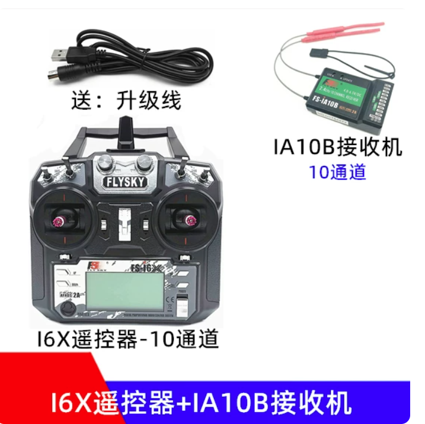
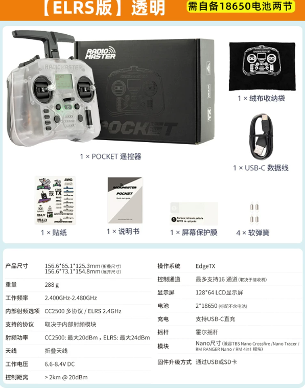
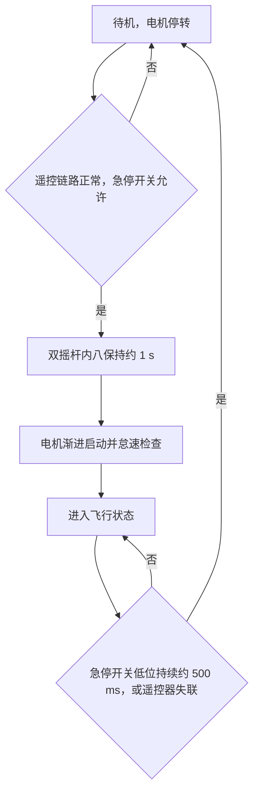

# 遥控器与飞行模式

## 为什么需要遥控器

遥控器对于调飞控绝对是必须的，或者说在我眼里，没有遥控器是完全不敢想象的。我在今年 4 月份调试无人机的时候，飞机还是裸桨状态，没有任何保护罩。包括前期调姿态环的时候，你可以理解为艺高人胆大，也可以理解为我从一开始就使用遥控器进行启动和保护。

我一开始选择的遥控器是富斯 i6X + IA10B 接收机。



这个接收机和单片机之间可以使用 SBUS 协议通信，同时也可以像控制舵机一样，直接输出 `1000 us~2000 us` 的脉宽来控制电调油门。前期校准商品电调的时候，我感觉这个功能还是挺方便的。

后面寒假调试的时候，我舍弃了 SBUS 接收方案。一个原因是这个接收机的体型太大了，那个时候我只能用学习板调飞机，再加上一堆热熔胶糊在一起，整架飞机非常臃肿。

另外，我也不知道是当时的驱动写得有问题，还是接收机本身的问题：如果遥控器断连了，单片机拿到的还是上一时刻的老数据，而且会一直保持。那时候偶尔会出现遥控器已经断联，我只能舍命去拔电池的情况。

所以后面我更换了一款颜值很高、本身用于穿越机的遥控器。（打了雷区之后，我一天到晚都在刷穿越机的入门、讲解和评测，还买了模拟器玩了好久。可惜手残加上没钱，不然我是真想买一架来玩。）



这个遥控器一个是颜值我真的很喜欢，另一个是质感也不错，通信波特率还更高一点。搭配通用的 ELRS 接收机，只需要 `5 V` 供电和串口的两根线就可以实现通信。这里需要区分一下：ELRS 是遥控器和接收机之间使用的协议，CRSF 是接收机和单片机之间使用的协议。

CRSF 驱动代码在 [`project/code/Protocols/crsf`](../../project/code/Protocols/crsf/) 中，这部分只负责接收遥控数据，并把各个通道转换成标准化后的值。后面的起飞解锁动作、状态机和飞行模式选择放在 [`fc_start_crsf.c`](../../project/code/FlightController/fc_start_crsf.c) 中；各个具体模式，例如姿态模式、速度环模式、跟车且车自动灭灯模式、跟车且手动遥控车模式，以及使用不同跟车控制器的模式，都放在 [`FlightController`](../../project/code/FlightController/) 文件夹下对应的 `fc_modeX.c` 中。

## 我怎么使用遥控器

我这里大致讲一下自己的遥控器使用逻辑。

左边摇杆平常基本不用，右边摇杆会根据不同 Mode 映射成不同的控制目标。比如姿态模式下，摇杆映射的是目标角度；速度模式下，摇杆映射的是目标速度；跟车模式下，则由飞机自己去跟车。

同时，我也会把遥控器数据通过空地串口下发给车模。车模也是一样的逻辑，有一套自己的 Mode，并且飞机和车模两边的 Mode 是对应的。

例如当前国赛版本里的 Mode 4 和 Mode 5 都是跟车，控制器的设计和参数也完全相同。唯一的区别在于：车模的 Mode 4 根据飞机下发的车体坐标系目标速度向量进行闭环控制；Mode 5 则先把遥控器摇杆映射成全局坐标系下的目标速度向量，再转换到车体坐标系，最后进行相同的闭环控制。

那么为什么要这样设计呢？

遥控器是一个极其方便的调试设备。调姿态环的时候，如果没有遥控器，哪怕可以使用上位机下发目标角度，也会因为需要操作电脑、担心手滑或者响应不及时，导致给出的目标角度非常保守。这样根本无法观察在不同外部目标激励下，当前控制器是如何响应的，有没有超调、延迟有多大、后续是否震荡，以及是否存在稳态误差。

但是有了遥控器以后，我平常基本都是让飞机实际飞起来，然后用遥控器“玩无人机”，同时把日志采集下来。飞完以后，再把不同控制器对应的日志放在一起分析和整定。

跟车调试也是一样的逻辑。要看无人机跟随车模时的响应和闭环效果，就得用遥控器操控车模，尽量让车模做任意、随机的移动，用来模拟实际灭信标灯时车模目标速度向量乱跳的情况。这样才能验证在这种情况下，无人机到底还能不能跟牢车模。

## 急停、解锁和模式选择

遥控器右上角的两挡开关是无人机急停开关。正常准备起飞时，需要先把它拨到允许位置；如果飞行过程中拨到低位并持续约 `500 ms`，无人机会紧急停转并回到待机状态。遥控器失联时也会直接走停机保护，不会再像早期 SBUS 方案那样一直使用上一帧的老数据。

解锁时，需要先保证右上角急停开关处于允许位置，再将两个摇杆长时间内八。当前代码要求内八连续保持约 `1 s`，之后电机会先经过渐进启动和怠速检查，再进入正式飞行状态。

我没有让飞机解锁后直接进入飞行，一个原因是那样比较吓人；另一个原因是，怠速旋转可以提前看出电调或者电机有没有明显问题，不至于四个电调坏了一个都没发现，一起飞就炸鸡。同时也可以在装配完成后检查一下，有没有线缆跑进桨叶的运动范围。

整个过程大致可以理解成：



左上角的两挡开关是车模使能开关，中间两个三挡开关是 Mode 选择键。这两个三挡开关实际上组成了一个三进制选择器，计算方式是：

```text
Mode = 左侧三挡开关位置 x 3 + 右侧三挡开关位置
```

例如左边是 `1`、右边是 `2`，那么最终选择的就是 Mode 5。两个开关一共可以组合出 Mode 0 到 Mode 8，也正好对应代码里的九种飞行模式。

[返回 Air 总文档](../../README.md) · [返回母仓库 README](../../../README.md)
