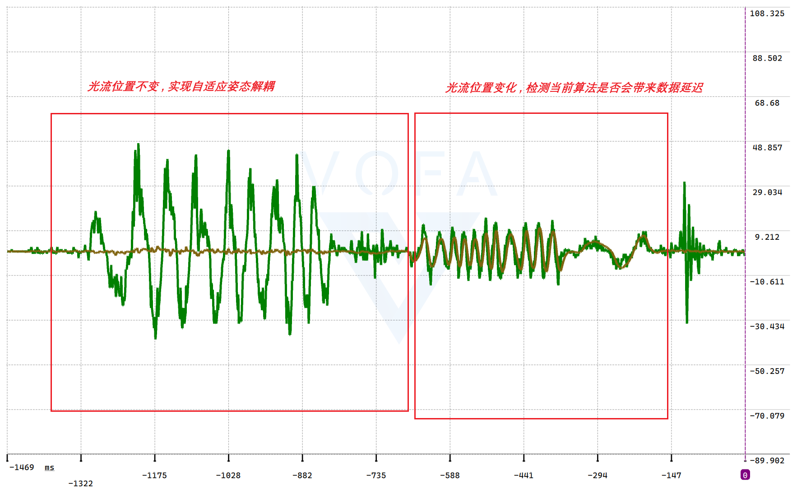

# 软件架构

其实也不好说这是不是所谓的“软件架构”。我主要还是想讲两件事：

1. 我的程序是怎么用时间片往前推进、怎么切换不同频率任务的。
2. 我是怎么管理这些文件的，以及每个文件大概是干什么的。

这里面有不少历史遗留文件。它们现在不一定还在用，但我又舍不得直接删掉。最典型的就是 `car_plan`，前前后后留了好几个版本。与其把这些历史全藏起来，我还是更想把它们为什么会出现、后来为什么又没用讲清楚。这样别人看代码时，至少不会对着一堆相似文件发蒙。

## 时间片

### 为什么没有用 RTOS

我没有采用很高级的东西，比如实时操作系统。一个原因是我本身没有系统学过 RTOS，对它的了解基本停留在多线程、任务优先级，以及 task 之间可以用不同方式传递数据这些概念上。

现在我也算入门了一段时间的操作系统，但由于早早进入了 Agent 开发时代，很多代码实际上都是“面向聊天框编程”。我知道 RTOS 很方便，也明确看到网上有人开源过 4BB7 的 RTOS 移植，但在第 21 届智能车比赛里，我最后还是没有用，主要是下面两个考虑。

第一个考虑很现实：我是个外行，只能让 AI 帮我移植。如果移植本身出了问题，或者碰上我以前长期留下来的坏习惯，比如全局变量满天飞、模块之间没留好 API、大家直接拿全局变量互相操作，那后续想把这些东西塞进不同任务里，只会越来越乱。

而且比赛开发很赶。我当时急着让飞机先飞起来，实在没时间再配置一堆初始化任务、信号量、队列之类的东西。RTOS 本身没有错，问题是我当时没有能力判断 AI 移植出来的东西到底靠不靠谱，也没有时间把原来的代码边界全部重做。

第二个考虑是调试风险。我很担心移植以后埋下一个很深的 bug。真碰到了，我自己可能完全没有能力解决，只能赌 AI 的随机 output。等代码继续往上堆以后，再想回头找问题就更头痛了。

所以最后我采用的是最朴素的办法：**定时器中断只负责计数，主循环轮询计数值，再执行对应的任务。**

相关入口都可以直接点进去看：

- 1 ms 定时器中断：[`pit0_ch0_isr()`](../../project/user/cm7_0_isr.c#L45)
- Core 0 主程序：[`main_cm7_0.c`](../../project/user/main_cm7_0.c)
- 1 kHz 高频任务入口：[`core0_run_fast_loop_step()`](../../project/user/main_cm7_0.c#L902)
- 低频时间片入口：[`core0_run_slow_slot()`](../../project/user/main_cm7_0.c#L1025)
- 主循环消费计数值的位置：[`main()`](../../project/user/main_cm7_0.c#L1125)

可以看到，定时器中断里几乎只有计数、使能和 1 ms 心跳推进，没有把姿态解算、控制器这一类大任务塞进去。`g_tick_1000HZ` 每增加一次，就表示又到了一个 1 kHz 任务。主循环发现它大于 0，就减一次，然后跑一遍高频任务。

如果高频任务暂时积压了，程序会优先把它补回来。只有 1 kHz 没有积压时，才会去跑 WiFi 命令轮询和分散在 10 个槽位里的低频任务。整个东西不高级，但它的行为比较直白：哪里慢了、哪里堵了，我还能顺着主循环一点点往下找。

### 从 2BL3 换到 4BB7 的经历

其实 4BB7 的性能对我来说真的太足够、太足够了！！！寒假时我的飞机还是用 2BL3 当主控，也能飞，也能跑图像跟随。

> 当时在家里调试的视频链接[开源文档链接视频]寒假2bl3调试飞行-哔哩哔哩】 https://b23.tv/vJi0Gqp

后面换主控，主要不是因为 2BL3 完全跑不动，而是它的引脚实在太捉襟见肘了。再加上老版本飞控的速度环，我前前后后调了快一个月，真是吃到大芬了。回学校以后还是调不好，于是我又买了一个新的 PMW3901，结果发现原来家里那个 3901 的数据差得逆天，几乎等于没数据。

我靠，那个时候我真的崩溃了。每天起早摸黑烧 token，试各种采集方式。现在回头看，当时的调试方法也比较“愚蠢”：唯一的手段就是插着下载器看静态 `printf`，飞机起飞以后的各种中间变量基本都看不到，差不多就是盲调。

当时 2BL3 的代码还在这个仓库里：[`Car_Air_Protocol/rebuilt_pmw3901`](https://github.com/ZhangStudyLife/Car_Air_Protocol/tree/rebuilt_pmw3901)。里面也有一百多次提交了。后面的速度估计实在是被 AI 堆得太厉害，已经成了屎山，根本没法继续用。

回学校前几天，我手上只有一块 4BB7 学习板，但还是硬把一整架飞机装起来了。用的是 Mark5 机架，板子太大放不进去，只能挂在飞机下面，再用热熔胶统一固定。整个造型非常抽象，但至少它真的飞起来了。

这段经历对我后来的影响还挺大。我现在更在意一套东西能不能被我自己理解、自己定位问题，而不是它看起来够不够高级。比赛里真正折磨人的，往往不是少用了一个高级框架，而是出了问题以后，你连自己在等什么、卡在哪里都不知道。

### 1 kHz 高频任务是怎么跑的

最内层是 1 kHz 的 IMU 采集、姿态解算和控制任务。整个调用顺序可以从 [`core0_run_fast_loop_step()`](../../project/user/main_cm7_0.c#L902) 往下看，大致是：

1. 轮询一次双核图像数据。
2. 调用 [`IMU_Update_1000HZ()`](../../project/code/Estimation/Attitude/IMU_TOP.c#L169) 更新 IMU 和姿态。
3. 调用两套位置、速度估计。
4. 每两次 1 kHz 循环运行一次 [`FC_Loop_500Hz()`](../../project/code/FlightController/fc_loop.c#L579)。
5. 每次都运行 [`FC_Loop_1000Hz()`](../../project/code/FlightController/fc_loop.c#L686)。
6. 顺便推进空地通信和当前启用的调试数据发送。

我实际测试过一次 `IMU_Update_1000HZ()`，耗时大约是 `55 us`。对 1 ms 的时间片来说，这部分其实很节约时间。但不能只看姿态解算本身，还得考虑其他会堵住时间片的东西。

比如一个软件 I²C 驱动，如果没有做特殊处理，可能光 `delay` 就耗掉 2 ms。那 1 kHz 内环一定会积压，这是万万不行的。因为 IMU 初始化成高采样率以后，它的噪声特性和直接用低采样率并不一样。假设 IMU 按 1000 Hz 采了 10 次，但程序丢掉 9 次、只用 1 次，看起来像是人为降成了 100 Hz，实际效果却不等于一开始就把 IMU 配成 100 Hz，噪声也可能大很多。

所以高频路径里一定不要放长时间阻塞的东西。碰到那种频率不高、但一次执行很久的任务，我更倾向于写成类似状态机的形式，把一个复杂任务拆成几个很小的步骤，每次时间片只往前走一点。毕竟这是裸机开发，程序不会像 RTOS 任务一样自动帮你切走。

### 为什么不把 IMU 采集和解算放进中断

至于为什么不把 IMU 采集和姿态解算直接放进中断，是因为我以前真的在这里出过问题，后来放回主循环反而一劳永逸了。

比如中断开启时机不合适，IMU 信号线又刚好接触不好，通信可能直接堵住。还有一种情况是，主循环里 AI 又写了一次 IMU 通信函数；主循环刚和 IMU 通信到一半，中断来了，又进去发起一次通信，那当然就卡了。

这种问题还很难查。至少 2026 年初的 AI 没有让我一眼看出来，我当时排查了挺长时间。所以现在中断只负责提供节拍，真正的采集和计算放在主循环里。这样做不是理论上最漂亮，但对我来说更容易看清执行顺序，也更容易调试。

## 代码架构

Air 端自己的代码主要放在 [`project/code`](../../project/code/) 下，可以先按下面这棵树理解：

- [`Display`](../../project/code/Display/)：屏幕显示和图像调试界面。
- [`Estimation`](../../project/code/Estimation/)：采集传感器数据，估计飞机的姿态、高度和速度。
- [`FlightController`](../../project/code/FlightController/)：飞控参数、各频率控制器、遥控器状态机、飞行模式和自动降落。
- [`HW_Drivers`](../../project/code/HW_Drivers/)：IMU、光流、TOF、电机、蜂鸣器等硬件驱动。
- [`Image`](../../project/code/Image/)：Air 端保存和处理图像结果的数据结构与少量后处理。
- [`IPC`](../../project/code/IPC/)：CM7_0 和 CM7_1 之间的核间通信。
- [`Planner`](../../project/code/Planner/)：路径规划、相机模型、多相机融合、速度规划等算法。
- [`Protocols`](../../project/code/Protocols/)：空地通信、相机 SPI、遥控器 CRSF 和 WiFi 调参通信。

如果只想抓主线，我觉得最重要的是 `Estimation`、`FlightController` 和 `Planner`。前者回答“飞机现在是什么状态”，中间回答“飞机应该怎么动”，后者回答“车接下来应该往哪里走”。剩下的驱动、通信和显示，都是在给这三块喂数据或者把结果送出去。

### 程序入口和双核分工

4BB7 这里用了两个 CM7 核：

- [`main_cm7_0.c`](../../project/user/main_cm7_0.c) 是主要的飞控入口，姿态估计、控制器、规划和大部分通信都从这里推进。
- [`main_cm7_1.c`](../../project/user/main_cm7_1.c) 主要负责三个相机的数据接收、候选关联和图像结果发布。
- [`cm7_0_isr.c`](../../project/user/cm7_0_isr.c) 和 [`cm7_1_isr.c`](../../project/user/cm7_1_isr.c) 分别放两个核的中断入口。

两个核之间怎么传图像结果，可以直接看 [`IPC/README.md`](../../project/code/IPC/README.md)。我这里不把共享内存地址和同步细节重新抄一遍，点进去看会更直接。

### Estimation：状态估计

[`Estimation`](../../project/code/Estimation/) 的意思就是先采集传感器数据，再估计无人机当前的状态。它主要分成三块。

#### Attitude：姿态估计

[`Estimation/Attitude`](../../project/code/Estimation/Attitude/) 是对无人机姿态的估计。最顶层入口在 [`IMU_TOP.c`](../../project/code/Estimation/Attitude/IMU_TOP.c)，里面把 IMU 读取、校准、滤波和姿态解算串在一起。

这一部分已经单独写了一篇文档，直接看[《IMU 与姿态估计》](./imu-and-attitude.md)就行。代码层面也不用从几千行校准代码硬啃，先从 `IMU_Update_1000HZ()` 往下顺会更清楚。

#### Height_Est：高度估计

[`Estimation/Height_Est`](../../project/code/Estimation/Height_Est/) 是高度估计。这个相对简单，目标就是得到当前高度和垂直速度，给后面的高度控制使用。具体实现看 [`Height_Est.c`](../../project/code/Estimation/Height_Est/Height_Est.c)，对应文档看[《高度估计与控制》](./height-estimation-and-control.md)。

#### Pos_Est：水平速度估计

接下来是最最最折磨我的部分。从 3 月到 6 月，我一直都在调速度估计和速度控制。相关代码在 [`Estimation/Pos_Est`](../../project/code/Estimation/Pos_Est/) 里，这个目录中有新旧两套光流处理，所以第一次看会有点乱。

[`FlowGyroDecoupler_LC302.c`](../../project/code/Estimation/Pos_Est/FlowGyroDecoupler_LC302.c) 是现在给 LC302 用的姿态解耦。LC302 给出的是光流积分量，可以结合高度换算成线速度，但飞机自身的姿态变化也会被光流看到，所以要先把这一部分影响剥掉。

处理前后的波形可以参考这张图：

[`FlowGyroDecoupler.c`](../../project/code/Estimation/Pos_Est/FlowGyroDecoupler.c) 是古早的 PMW3901 版本，很早就没有实际使用了，但文件还留在那里。

两套速度估计的入口都在 [`Pos_Est.c`](../../project/code/Estimation/Pos_Est/Pos_Est.c)，声明在 [`Pos_Est.h`](../../project/code/Estimation/Pos_Est/Pos_Est.h)：

- 第一套是最基础的互补滤波，把加速度和 LC302 融合，并把光流当作测量飞机自身速度的传感器。
- `Pos_Est_2` 会结合车端上传的车速，把光流当作飞机和车之间相对速度的观测。

第二套实际上可以叫“智能车特调”。因为蓝布很光滑，车辆本身反而有纹理，所以我针对这个场景做了特殊融合。省赛车模和飞机最后用的就是这套速度反馈。

### FlightController：飞控

[`FlightController`](../../project/code/FlightController/) 里几乎不负责“估计”，主要是消费前面已经算出来的状态，再生成控制输出。这里面包括飞控参数、不同频率的控制器、遥控器状态机、飞行模式选择和自动降落。

想看整体执行顺序，直接看 [`fc_loop.c`](../../project/code/FlightController/fc_loop.c) 里的 `1000 Hz`、`500 Hz`、`100 Hz` 和 `50 Hz` 循环就够了。参数集中放在 [`fc_params.c`](../../project/code/FlightController/fc_params.c)，各个模式则放在 [`fc_mode0.c` 到 `fc_mode8.c`](../../project/code/FlightController/)。

其他几个比较明确的入口：

- [`auto_landing.c`](../../project/code/FlightController/auto_landing.c)：自动降落。
- [`fc_start_crsf.c`](../../project/code/FlightController/fc_start_crsf.c)：遥控器解锁、起飞和紧急停机状态。
- [`pid_core.c`](../../project/code/FlightController/pid_core.c)：PID 基础实现。
- [`yaw_align.c`](../../project/code/FlightController/yaw_align.c)：yaw 目标的选择。

`yaw_align` 里，模式 0 是让无人机的 yaw 始终保持 0；模式 1 是根据算法让机头对准目标信标灯，省赛用的就是这个方案；模式 2 是步进搜索。反正最后实际飞下来，我还是觉得 yaw 不旋转时调得最舒服。

### HW_Drivers：硬件驱动

[`HW_Drivers`](../../project/code/HW_Drivers/) 没有太多玄学，就是把不同外设的通信拆开：

- [`ICM42688`](../../project/code/HW_Drivers/ICM42688/)、[`BMI088`](../../project/code/HW_Drivers/BMI088/)：IMU 驱动。
- [`LC302`](../../project/code/HW_Drivers/LC302/)、[`PMW3901`](../../project/code/HW_Drivers/PMW3901/)：新旧光流驱动。
- [`BMP388`](../../project/code/HW_Drivers/BMP388/)、[`VL53L1X`](../../project/code/HW_Drivers/VL53L1X/)：气压计和 TOF。
- [`Motor`](../../project/code/HW_Drivers/Motor/)：电机输出。
- [`Beep`](../../project/code/HW_Drivers/Beep/)：蜂鸣器。

这部分看名字基本就知道对应什么硬件，需要查哪个传感器时再点进去看就行。

### Display、Image 和 IPC

[`Display`](../../project/code/Display/) 主要是屏幕显示和调试界面。

[`Image`](../../project/code/Image/) 这边我也没啥好说的，历史上有过六千行屎山代码，实际上做的东西可能就是最基础的连通域，问豆包一遍都能写。现在 Air 端这里主要保留图像数据结构和地平线等后处理，真正来自三个相机的结果由 Core 1 接收，再通过 IPC 发给 Core 0。

[`IPC`](../../project/code/IPC/) 就是核间通信。原理本身没啥好说的，但双核同时读写图像数据时，谁发布、谁复制、怎么保证拿到完整快照还是挺重要的。这部分已经在 [`IPC/README.md`](../../project/code/IPC/README.md) 里写清楚了，直接跳过去看比我在这里复述强。

### Planner：规划算法

[`Planner`](../../project/code/Planner/) 是算法的大头。这里既有四套路径规划，也有相机模型、多相机融合、投影中心和速度规划。

四套 `car_plan` 最好先从统一入口 [`car_plan_entry.c`](../../project/code/Planner/car_plan_entry.c) 看。它会同时更新四套算法，再根据 `Car_Plan_Mode` 选择最终输出。

- [`car_plan.c`](../../project/code/Planner/car_plan.c) 和 [`car_plan_2.c`](../../project/code/Planner/car_plan_2.c) 更适合麦轮车模。它们从像素域确定目标信标灯，再结合车灯算出目标车速向量，最后根据车灯角度投影到车体坐标系。
- [`car_plan_3.c`](../../project/code/Planner/car_plan_3.c) 和 [`car_plan_4.c`](../../project/code/Planner/car_plan_4.c) 才是 F 车能用的版本。`car_plan_4` 相比 `car_plan_3` 多了更激进的速度决策，也加入了“两盏灯都在前方就猛猛加速”的策略。不过受国赛场地和图像效果限制，最后连五成实力都没发挥出来。

这里中间还发生过一个很折磨的事情。F 车本身调好以后，我开始让它自动驾驶，结果它连直线都走不直。目标信标灯明明就在前方，理论上差速车只要先把车头对准，再猛地加速就行。后面连续采了两天日志，最终还是在 AI 大手的帮助下建立了相机模型，车才终于能跑直。

其他文件大概是这样：

- [`beacon_lost_detector.c`](../../project/code/Planner/beacon_lost_detector.c)：灭信标检测。很早就写了，但稳定性不到 100%，所以一直没有真正接入。效果纯粹取决于图像算法，而我目前的图像不能说是屎，只能说也差不多。
- [`CameraModel.c`](../../project/code/Planner/CameraModel.c)：相机模型和标定参数。
- [`car_lamp_fused.c`](../../project/code/Planner/car_lamp_fused.c)：车灯融合。
- [`pix_to_distance.c`](../../project/code/Planner/pix_to_distance.c)：省赛前尝试把像素域换成距离域，用函数做拟合。但实际效果和在像素域里组合 `P`、`P²` 控制器差不多，那我还不如直接调 `P` 和 `P²` 参数。
- [`ProjectionCenter.c`](../../project/code/Planner/ProjectionCenter.c)：计算投影点。飞机倾斜时，图像中心并不等于飞机在地面的垂直投影点。
- [`pull_detect.c`](../../project/code/Planner/pull_detect.c)：拉扯检测。没实际用过。检测了又咋样呢？检测了也控制不好啊，呜呜。
- [`speed_plan.c`](../../project/code/Planner/speed_plan.c)：从路径规划里抽出来的速度规划。
- [`Three_Camera.c`](../../project/code/Planner/Three_Camera.c)：三个相机经过相机模型以后，再投影到全局坐标系做融合。

### Protocols：外部通信

[`Protocols`](../../project/code/Protocols/) 放外部通信，目前主要有四块：

- [`AirComm`](../../project/code/Protocols/AirComm/)：空地串口调参、心跳包和遥测数据。
- [`CameraSpi`](../../project/code/Protocols/CameraSpi/)：和两个图像小板做 SPI 主从通信。
- [`crsf`](../../project/code/Protocols/crsf/)：解析遥控器接收机的 CRSF 串口数据。
- [`wifi`](../../project/code/Protocols/wifi/)：WiFiSPI、JustFloat 遥测、命令解析、上位机校准 IMU 和参数修改。

WiFi 里面又拆成 `wifi_cmd`、`wifi_params`、`wifi_cal_imu` 和 `wifi_justfloat`。这部分已经有单独的 [`wifi/README.MD`](../../project/code/Protocols/wifi/README.MD)，协议、命令和调用链都在里面，这里就不再堆代码细节了。

## 最后的一点感悟

这套代码肯定谈不上优雅，历史文件也很多，有些地方甚至能明显看出我是怎么一路试错过来的。但对我来说，它至少有一个好处：现在出了问题，我大概知道应该先去哪个目录、看哪一层数据。

我后来越来越觉得，比赛项目的架构不是先画一张很漂亮的图，再照着图把代码填进去。更多时候是先被真实问题打几拳，才知道哪些东西必须分开，哪些任务绝对不能阻塞，哪些中间量一定要能看到。那些留在目录里的 `car_plan`、旧光流和临时调试代码，某种意义上也都是这段过程的记录。

如果只是为了把代码显得干净，我当然可以把旧文件全部删掉。但我还是想先把它们为什么存在写清楚。以后真要继续整理，也应该是在确认新方案已经完全覆盖旧方案以后再动，而不是看见文件多就一股脑删掉。

[返回 Air 总文档](../../README.md) · [返回母仓库 README](https://github.com/ZhangStudyLife/HDUASC-SmartCar-21st-FlyOverMinefield/blob/national-2026/README.md)
