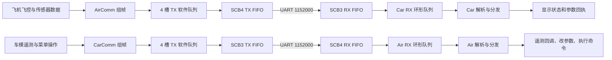
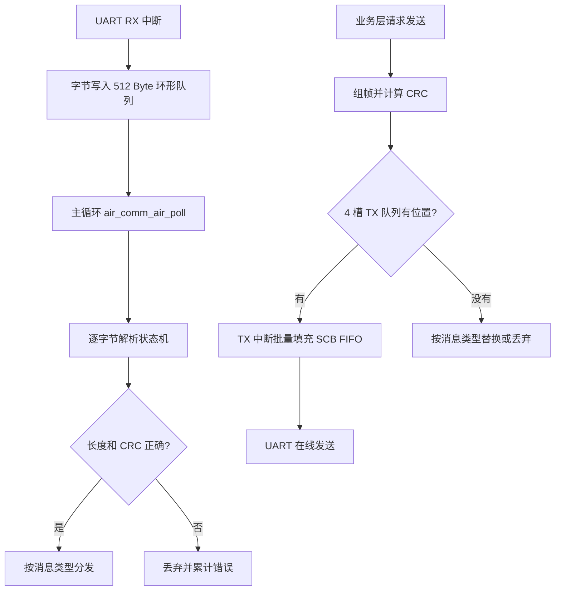
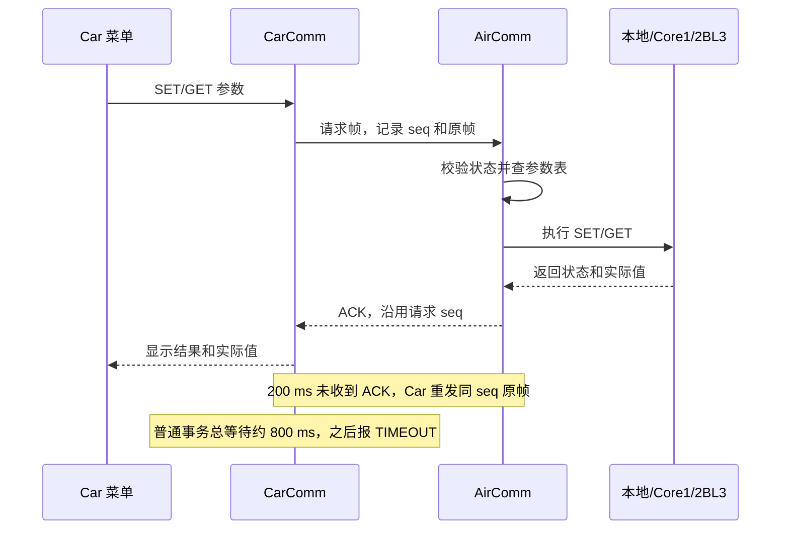

# AirComm 空地通信

## 文档目标

说明 Air 与 Car 之间的 UART 协议、数据语义、时序和离线处理。

## 人话梗概

这部分其实没啥特别玄学的，硬件上就是用一根大约 `1.5 m` 的空地串口线，把飞机和车模直接连起来。因为飞机上没有菜单和按键，所以飞机参数也是从车模端的菜单发过来，再通过 AirComm 完成修改和回执。说实话，这套调参系统前期实际上没咋用到，因为那个时候一直调不好的地方大多还是算法本身的问题，基本就是改完代码继续烧录、继续烧录，暂时还没到只改几个参数就能解决问题的阶段。

真正踩坑的地方反而是这根线。`1.5 m` 对 TTL 串口来说已经比较长了，而且我们还要跑 `1152000` 的波特率。最开始虽然也能正常通信，但是偶尔会出现车模端收不到数据，或者串口 CRC 报错的情况。

最基础的连接至少需要四根线：电源正、电源地、TX 和 RX。前期我们直接拿醋酸胶布把这些线从头到尾都缠在一起，串口信号线和可能通过较大电流的供电线基本一直贴着走，所以我怀疑偶发错误和这部分干扰有关系。

后面我们的处理也很直接：额外增加两根地线，让飞机下发和车模上传各自都有一根配对地线。两根串口信号线分别和自己的地线绞在一起，供电正和供电地则单独走。物理上总共是六根导线，从功能上看则是下面四组：

```text
电源正
电源地
飞机 TX + 配对地线绞在一起 -> 车模 RX
车模 TX + 配对地线绞在一起 -> 飞机 RX
```

固定的时候也不用再拿醋酸胶布把整根线完全包死，每隔 `10~20 cm` 绑一个点，让双绞关系不要散开就行。按我们这套实物测试下来，这样在 `1152000` 波特率下运行，CRC 基本就不会再报错了。当然，这只是当前线长、接插件和整车布线下的实测结果，并不是说 TTL 串口随便拉 `1.5 m` 都一定稳定。

至于后面的协议设计、参数下发修改、遥控数据回传和心跳判断，这些在如今的 AI 时代确实没有以前那么麻烦。只要把谁发给谁、帧头、消息类型、长度、数据内容、CRC、回执和超时规则写清楚，基本上提示词写好以后，一遍就能把主体框架搭出来。

不过 AI 能帮忙快速写代码，不代表协议本身可以随便设计。实时数据来不及发送时是丢旧帧还是堵着等、参数修改后要不要回执、多久没收到心跳算离线，这些还是得自己先想明白。当前实现会每 `200 ms` 发送一次心跳，超过 `600 ms` 没有收到对端心跳就判断离线；实时数据走异步发送队列，来不及的时候宁可替换或丢掉旧数据，也不应该为了通信一直堵住飞控。

具体帧格式、参数表、远程命令和收发队列都在 [`air_comm_air.h`](../../project/code/Protocols/AirComm/air_comm_air.h) 和 [`air_comm_air.c`](../../project/code/Protocols/AirComm/air_comm_air.c) 里。想看整体定义先看头文件，想看 CRC、解析状态机和异步发送过程再进 `.c` 文件就行。

## 下面开始认真讲这套串口到底是怎么跑的

上面的部分主要是在讲我为什么要做这套东西，以及实际布线时踩过什么坑。下面这一部分就不再只讲梗概了，而是按照当前代码，把空地串口从硬件、中断、缓冲区，一直讲到心跳、遥测、参数修改和远程命令。

先给一个总图。虽然功能看起来不少，但是所有数据最后都走同一套帧协议和收发队列：



这张图里最重要的一点是：**飞控代码不会直接等串口把一整帧发完，串口中断里也不会直接处理参数和业务逻辑。** 发送、接收和业务处理被拆开以后，串口即使临时忙、收到半帧、收到错帧，甚至整根线根本没插，都不会把飞控控制环堵在那里。

## 硬件外设和基础配置

飞机和车模两边用的是同一种思路，只是 UART 实例和引脚不同：

| 端  | UART       | 底层 SCB | TX        | RX        |      波特率 | TX FIFO 触发水位 |
| --- | ---------- | -------- | --------- | --------- | ----------: | ---------------: |
| Air | `UART_2` | `SCB4` | `P10_1` | `P10_0` | `1152000` |      `64 Byte` |
| Car | `UART_3` | `SCB3` | `P17_2` | `P17_1` | `1152000` |      `32 Byte` |

Air 端在 [`air_comm_air_init()`](../../project/code/Protocols/AirComm/air_comm_air.c) 中初始化 `UART_2`，打开 RX 中断，并先关闭暂时用不到的 TX trigger。Car 端则在 [`air_comm_car_init()`](../../../CYT4bb7_Car/project/code/Protocols/AirComm/air_comm_car.c) 中完成对应初始化。

这里没有使用 DMA。当前方案是：

```text
软件接收环形队列 + 软件发送帧队列 + SCB 硬件 FIFO + UART 收发中断
```

DMA 当然还能继续减少 CPU 搬运字节的次数，但对这里的帧长和数据量来说，中断配合 FIFO 已经能够满足要求，而且代码和调试链路都更直接。所以当前的重点不是追求“外设越高级越好”，而是保证串口搬运不会阻塞控制流程，并且拥塞时的行为是确定的。

## “非阻塞”具体非阻塞在哪里

我这里说的非阻塞，不是说串口数据不需要传输时间，而是说 **CPU 不会为了等串口线上的传输完成，一直卡在发送函数里死等**。

一次完整的发送大概是下面这样：

1. 业务代码准备 payload。
2. AirComm 补上帧头、类型、序号、长度和 CRC。
3. 完整帧复制到软件 TX 队列。
4. 打开 SCB 的 TX trigger，然后发送函数立即返回。
5. 后面由 UART TX 中断把数据分批塞进硬件 FIFO。
6. 当前帧塞完后自动取下一帧，队列空了就关闭 TX trigger。

接收则刚好反过来：

1. UART RX 中断把硬件 FIFO 里已经到达的字节尽快读出来。
2. ISR 只把字节放进软件 RX 环形队列。
3. 主循环中的 `poll()` 再慢慢做帧头匹配、CRC 校验和业务分发。



这也就解释了为什么 **空地串口插没插都不应该影响飞机正常飞行**：

- 没插线时，RX 中断收不到字节，`poll()` 看见队列为空就直接结束。
- 对端没上电时，TX 仍然只是把数据交给本机 UART 外设，不会等待对端回应。
- 对端一直不回心跳时，只会把连接状态改为离线，并触发对应的蜂鸣提示，不会卡住姿态、位置或者控制器更新。
- TX 队列满时，发送接口会失败或按实时数据策略丢帧，不会原地等待队列腾位置。
- 收到乱码、半帧或者 CRC 错误时，解析器会丢掉错误数据并重新找帧头，不会一直等某个永远到不了的字节。

当然，“不影响飞行”说的是通信模块不会阻塞控制环。车模数据本身如果被某段上层策略当成控制依据，那么断联以后应该由上层进入自己的安全退化逻辑，这和串口驱动会不会卡死是两件事。另外，当一笔跨核参数事务正在执行时，代码会暂时阻止解锁，避免参数只改到一半就起飞；这属于主动的状态保护，不是串口断联导致的堵塞。

## RX 接收缓冲区怎么设计

Air 端 RX 使用一个 `512 Byte` 的环形队列，内部保存：

- `data[512]`：真正存字节的数组；
- `head`：中断下一次写入的位置；
- `tail`：主循环下一次读取的位置。

UART ISR 的处理放在 [`cm7_0_isr.c`](../../project/user/cm7_0_isr.c) 中。收到中断后，它会用 `uart_query_byte()` 把当前硬件 FIFO 里的字节全部取出，每取出一个字节就调用 `air_comm_air_rx_byte()` 写入环形队列。

中断里故意不做下面这些事情：

- 不搜索帧头；
- 不计算整帧 CRC；
- 不查参数表；
- 不修改飞控参数；
- 不调用远程命令；
- 不等待剩余字节。

原因很简单：ISR 越短越好。串口中断最该做的事情就是赶紧把硬件 FIFO 腾出来，至于这个字节是什么意思，留到正常调度里处理。

如果 `head` 再向前一步就要追上 `tail`，说明软件队列确实满了。这时当前实现会丢掉**新来的字节**，同时增加 `rx_queue_overflow_count`。它不会覆盖还没解析的旧数据，也不会在中断里等主循环来消费。

Air 端的 `air_comm_air_poll()` 每次最多消费 `512` 个字节。这个上限相当于一个保险：哪怕线路上连续来了很多数据，单次 poll 也不会无限循环。正常情况下队列会很快被清空；真发生持续灌爆时，统计量也能明确告诉我问题发生在“接收队列来不及消费”，而不是让我只看到一个模糊的通信失败。

Car 端也是同样的 `512 Byte` 环形队列和 ISR 只收字节、主循环再解析的结构，可以直接对照 [`air_comm_car.c`](../../../CYT4bb7_Car/project/code/Protocols/AirComm/air_comm_car.c)。

## TX 发送缓冲区和拥塞策略

TX 没有做成一个单纯的字节环形队列，而是做成了 **4 个固定的完整帧槽**。每个槽最大 `259 Byte`，来源是：

```text
最大 payload 250 Byte + 固定协议开销 9 Byte = 最大帧长 259 Byte
```

每个槽除了保存帧数据和长度，还会保存消息类型。队头另外维护一个 `offset`，表示当前帧已经有多少字节被填进了硬件 FIFO。这样一帧即使不能一次性全部塞进 SCB FIFO，下次 TX 中断也能从上次的位置继续，不需要重新组帧。

TX ISR 使用 `Cy_SCB_UART_PutArray()` 批量填 FIFO，而不是一个中断只塞一个字节。队头帧全部移交给硬件 FIFO 以后，软件队列才把 `head` 移到下一槽；所有帧处理完以后，TX trigger 会被关闭，避免空队列还在重复进中断。

### 为什么实时数据不能和参数 ACK 一视同仁

`RUN_DATA` 是高频实时数据。假设 20 ms 前的姿态帧还没发出去，那么现在继续排着它的意义已经不大，最新状态通常更有价值。参数 ACK、命令 ACK 则不同，这些是一次事务的结果，不能随便被遥测挤掉。

所以当前 TX 队列对 `RUN_DATA` 有单独的拥塞规则：

1. 待发送的 `RUN_DATA` 最多占 3 个槽，至少给心跳、参数 ACK 或命令 ACK 留一个竞争机会。
2. 队列已经满，或者已经排了 3 帧 `RUN_DATA` 时，优先找一帧还没有开始发送的旧 `RUN_DATA`，直接用最新数据替换它。
3. 正在发送的队头帧不能替换，否则线上会出现半帧旧数据加半帧新数据。
4. 如果没有可替换的旧实时帧，就丢掉这次新实时帧。
5. 替换和丢弃分别记录在 `tx_run_data_replace_count`、`tx_run_data_drop_count` 中。

普通帧在 4 个槽都满时也不会等待，只会返回发送失败。上层下一次调度可以继续尝试，控制环不会因为“这个 ACK 现在必须塞进去”而被卡住。

这个取舍我认为很重要：**遥测追求最新，事务消息追求确定，控制环则永远比通信队列优先。**

## 速率到底够不够，CPU 又花在哪里

UART 设为 `1152000 bit/s`。按常见的 `8N1` 算法，一个字节在线上需要 1 位起始位、8 位数据和 1 位停止位，也就是 `10 bit`。所以单向理论有效字节率大约是：

```text
1152000 / 10 = 115200 Byte/s
```

当前几种主要实时包可以直接算出线速占用：

| 数据                        |     单帧总长 | 200 Hz 每秒字节数 | 单帧线传输时间 | 单向线速占用 |
| --------------------------- | -----------: | ----------------: | -------------: | -----------: |
| Air 飞行关键包，17 个 float |  `78 Byte` |  `15600 Byte/s` | 约`0.677 ms` | 约`13.54%` |
| Air 待机诊断包，52 个 float | `218 Byte` |  `43600 Byte/s` | 约`1.892 ms` | 约`37.85%` |
| Car 上行包，11 个 float     |  `54 Byte` |  `10800 Byte/s` | 约`0.469 ms` |  约`9.38%` |
| 单个心跳包                  |  `15 Byte` |     `75 Byte/s` | 约`0.130 ms` |  约`0.07%` |

串口是全双工，Air 下发和 Car 上行分别占各自方向的线，不需要把两个方向简单相加后再和一条单向带宽比较。即使 Air 在待机时发完整的 52 项诊断包，单向仍然还有比较充足的余量。

这里也要把“线传输时间”和“CPU 占用时间”分开。比如 218 Byte 的帧在线上需要约 `1.892 ms`，但 CPU 并没有在函数里等这 `1.892 ms`，绝大部分时间是 UART 外设自己在移位发送。CPU 做的是组帧、复制到软件队列，以及 TX 中断触发后批量填几次 FIFO。

当前仓库里没有固定主频、编译优化等级和测试方法下的周期统计，因此我不会在这里硬写一个看起来很漂亮、实际上没测过的“CPU 占用百分比”。如果后续真要量，可以在 `air_comm_air_poll()`、TX ISR 和 200 Hz 组帧入口前后翻 GPIO，拿逻辑分析仪统计高电平占空比；或者用 CPU cycle counter 分别累计周期。现阶段从代码能够确定的是：它没有按线速忙等，通信耗时不会等价地变成 CPU 被占满的时间。

## 统一帧格式

所有心跳、遥测、参数和命令都使用同一种帧外壳：

| 字段    |        长度 | 说明                               |
| ------- | ----------: | ---------------------------------- |
| Header  |      4 Byte | 固定为`AA AA 55 55`              |
| Type    |      1 Byte | 消息类型                           |
| Seq     |      1 Byte | 序列号                             |
| Len     |      1 Byte | payload 长度，最大`250`          |
| Payload | 0～250 Byte | 各类消息自己的内容                 |
| CRC     |      2 Byte | `CRC-16/CCITT-FALSE`，低字节先发 |

因此固定开销是 `4 + 1 + 1 + 1 + 2 = 9 Byte`。8 位 `seq` 在帧成功放进 TX 队列后递增，超过 `255` 后自然回到 `0`。对于高频遥测，它主要用于观察丢帧；对于参数和命令，它还会参与 ACK 对应和重传去重。

CRC 参数为：

```text
算法：CRC-16/CCITT-FALSE
多项式：0x1021
初值：0xFFFF
发送顺序：CRC 低字节在前，高字节在后
覆盖范围：Header + Type + Seq + Len + Payload
```

这里按当前发送和接收代码的实际行为写：**CRC 包含 4 Byte 帧头。** 源文件中有一处旧注释写成了“不含帧头”，但组帧和校验实现实际都把帧头算进去了。接其他设备时应该以代码行为和上面的表为准，否则一定会出现双方算出来的 CRC 不一致。

多字节数值当前按小端序放进 payload，`RUN_DATA` 中的浮点数按 4 Byte `float` 传输。因为 Air 和 Car 使用同类 MCU，这样做简单直接；如果以后接 PC、其他架构或者换成不同浮点格式，就需要明确做字节序和 IEEE 754 格式转换，不能默认 memcpy 后一定通用。

## 接收解析状态机

RX 队列中的字节不会假设“一次进来的刚好就是一整帧”，因为串口本来就是字节流。解析器会逐字节推进：

1. 依次寻找 `AA AA 55 55` 四字节帧头。
2. 读取 `type`、`seq` 和 `len`。
3. 如果 `len > 250`，立即判为超长帧，增加 `rx_oversize_count` 并重新找帧头。
4. 按 `len` 收齐 payload。
5. 再读取 CRC 低字节和高字节。
6. 用完整待校验内容重新计算 CRC。
7. CRC 正确才按 `type` 分发；错误则增加 `crc_error_count`，整帧不进入业务层。

这种状态机能处理几种很常见的情况：一次 poll 只收到半帧、一次 poll 连续收到多帧、上电时刚好从一帧中间开始接收，以及中间夹了噪声字节。出错以后解析器会重新寻找帧头，而不是把后面所有数据永久错位。

## 消息类型一览

|     Type | 名称              | 方向       | 用途                        |
| -------: | ----------------- | ---------- | --------------------------- |
| `0x01` | `SET_PARAM`     | Car → Air | 请求修改一个参数            |
| `0x02` | `ACK_PARAM`     | Air → Car | 返回修改状态和实际值        |
| `0x03` | `EXEC_COMMAND`  | Car → Air | 请求执行远程命令            |
| `0x04` | `ACK_COMMAND`   | Air → Car | 返回命令执行结果文本        |
| `0x05` | `HEARTBEAT`     | 双向       | 维持在线状态和携带本端 tick |
| `0x06` | `RUN_DATA`      | 双向       | 高频浮点遥测/控制相关数据   |
| `0x07` | `GET_PARAM`     | Car → Air | 请求读取一个参数            |
| `0x08` | `ACK_GET_PARAM` | Air → Car | 返回读取状态和实际值        |

把所有功能放在统一帧里有一个很现实的好处：物理串口、队列、CRC 和解析状态机只写一套。后续加业务时只需要定义新的 type 和 payload，不需要再复制一套串口驱动。

## 心跳、在线状态和断联判断

Air 和 Car 都每 `200 ms` 主动发一次心跳，也就是理论上每秒 5 帧。心跳 payload 目前是：

```text
2 Byte reserved + 4 Byte tick_ms
```

`reserved` 给后面扩展保留，`tick_ms` 是本端毫秒计时。收到心跳以后记录最后一次在线时间；超过 `600 ms` 没收到对端心跳，就认为对端离线。

在线状态不是简单的 true/false，而是三种：

|  状态 | 含义                       |
| ----: | -------------------------- |
| `0` | 上电后从来没有建立过通信   |
| `1` | 当前在线                   |
| `2` | 之前在线过，但现在已经超时 |

Air 端还有一个比较宽松的处理：只要收到任意一帧 CRC 正确的数据，也会调用在线标记逻辑刷新 Car 活跃时间。所以哪怕某一帧心跳刚好丢了，只要实时数据还在正常到达，就不会机械地把 Car 判成离线。

离线以后两边都可以用蜂鸣器提示。这个提示只是把“线可能没插好、对端可能没上电”暴露给人看，不参与串口等待，也不会停止飞控的 1 kHz 更新。Car 端当前使用约 1 秒响、1 秒停的节奏提示断联，Air 端也在自己的慢速调度里维护断联蜂鸣状态。

心跳在线和数据新鲜度还不是同一个概念。对端可能仍然在发心跳，但某类 `RUN_DATA` 已经很久没有更新，所以 Car 对运行数据另外使用 `100 ms` 新鲜度限制，过期后不再继续使用旧控制数据。Air 端也提供 `air_comm_air_is_run_data_fresh(timeout_ms)`，让上层可以按自己的容忍时间判断 Car 数据还能不能用。

## RUN_DATA：双向高频遥测

`RUN_DATA` 的 payload 很简单：

```text
1 Byte count + count × 4 Byte float
```

第一个字节告诉接收端后面有多少个 `float`。接收端校验长度后，把数据解出来，保存为最新一帧，并调用已注册的回调。Air 端的回调注册和实际字段使用可以看 [`on_car_data()`](../../project/user/main_cm7_0.c)，Air 下发数据的组装可以看同文件中的 `send_air_run_data_200hz()`。

之所以没有给每个实时字段单独发一帧，是因为帧头和 CRC 都有固定开销。一次打包多个 float 更省带宽，也能保证同一帧里的姿态、速度和状态基本对应同一时刻。

### Air 下发给 Car：飞行关键包

飞机处于 `TAKEOFF`、`FLYING` 或 `LANDING` 时，当前会以 `200 Hz` 下发 17 个 float。飞行时只发控制真正关心的数据，可以减少中断和链路占用：

| 索引 | 含义                     |
| ---: | ------------------------ |
|    0 | Air 当前状态             |
| 1～9 | CRSF 标准化后的 CH0～CH8 |
|   10 | yaw 目标角               |
|   11 | CarPlan 是否有效         |
|   12 | CarPlan 横移目标速度     |
|   13 | CarPlan 前进目标速度     |
|   14 | 信标是否丢失             |
|   15 | Air 的 tick 同步时间     |
|   16 | 是否允许开启负压         |

这里的 CRSF 数据就是遥控器数据在 Air 端解析、归一化后的结果。也就是说，车模不需要再接一套遥控接收机，飞机可以把自己已经拿到的通道状态通过空地串口同步给 Car。真正使用时仍然要看数据新鲜度，不能在断联后无限沿用最后一帧油门或开关状态。

### Air 下发给 Car：待机诊断包

待机时更适合观察系统，所以当前发送完整的 52 个 float：

|   索引 | 含义                           |
| -----: | ------------------------------ |
|      0 | 融合高度                       |
|   1～3 | roll、pitch、yaw               |
|   4～5 | 位置估计速度                   |
|      6 | Air 当前状态                   |
|  7～14 | CRSF CH0～CH7                  |
|     15 | yaw 目标角                     |
|     16 | Air tick                       |
|     17 | CarPlan 是否有效               |
| 18～19 | CarPlan 横移、前进目标速度     |
| 20～22 | 当前保留为 0                   |
|     23 | 信标是否丢失                   |
|     24 | CRSF CH8                       |
| 25～28 | 四路 TOF 数据                  |
| 29～30 | 光流原始积分                   |
| 31～32 | 陀螺仪解耦后的光流             |
| 33～35 | 原始 gyro 三轴                 |
| 36～38 | 原始 accel 三轴                |
| 39～41 | 滤波后 gyro 三轴               |
| 42～44 | 滤波后 accel 三轴              |
| 45～46 | 两块相机板的在线/GPIO 组合状态 |
|     47 | 两块相机板的错误码组合         |
| 48～51 | 两块相机板最后收到的帧头字节   |

诊断包不是为了让控制器依赖 52 个量，而是让我在待机调试时能从地面侧一次看到飞控、遥控、TOF、光流、IMU 和相机板通信状态。进入飞行状态后切换成 17 项关键包，就是在“可观察性”和“实时性”之间做区分。

### Car 上传给 Air

主车工程当前每帧上传 11 个 float：

| 索引 | `CYT4bb7_Car` 当前发送内容 |
| ---: | ---------------------------- |
|    0 | 车体速度 X                   |
|    1 | 车体速度 Y                   |
|    2 | 是否压到信标                 |
|    3 | Car yaw                      |
|    4 | 低通后的 yaw rate            |
| 5～9 | 当前保留为 0                 |
|   10 | Car tick                     |

Air 收到后会保存 Car 的速度、yaw、yaw rate、目标量和大转弯状态，并用索引 10 的 Car tick 判断是不是真的来了一帧新数据。只有这个同步时间发生变化，`g_car_last_update_time_ms` 才刷新，避免一份旧数据被重复处理后看起来仍然“很新”。

不过这里必须提醒一句：**当前主车工程和 Air 对 11 项上行数据的字段解释还没有完全对齐。** Air 当前把索引 2 当作 `Car yaw target`，把 5、6、7 当作目标速度 X、目标速度 Y 和大转弯状态；而 `CYT4bb7_Car` 的索引 2 实际发的是“是否压到信标”，5～7 还是 0。另一份 [`CYT4BB7_Car_F` 的实现](../../../CYT4BB7_Car_F/project/code/Controller/car_loop.c) 更接近 Air 当前解释。这个问题不会让串口解析崩掉，但会让字段语义错位，所以后续两端联调前一定要先统一数据字典。

## 参数读取和修改

飞机没有自己的屏幕菜单，所以参数操作的基本链路是：Car 菜单发请求，Air 查参数并执行，最后 Air 把结果和实际值回给 Car。这个过程不是“发一个 float 过去就完了”，而是一笔有序号、有状态、有超时和重试的事务。

### 参数帧的 payload

```text
SET_PARAM：name_len + name + float value
GET_PARAM：name_len + name
ACK_PARAM / ACK_GET_PARAM：status + name_len + name + actual_value
```

参数名最大 `32 Byte`。ACK 不只返回成功或失败，还返回参数名和最终实际值，因此 Car 可以确认回来的到底是哪一项，也可以显示经过限幅或远端读回后的真实结果。

### Air 端参数表

Air 参数表最大可以容纳 `384` 项，当前初始化会检查默认注册数是否正好为 `256`。每一项记录：

- 参数名；
- 绑定变量的指针；
- 类型，目前支持 `float` 和 `int32`；
- 参数位于本地 Core0、Core1，还是两颗 2BL3；
- 远端使用的 `param_id`；
- 允许的最小值和最大值。

同名参数再次注册时会更新原来的表项，不会白白占掉一个新槽。收到不存在的名字会返回 `NOT_FOUND`；本地参数超过范围时会先限幅到合法值，并通过 `OUT_OF_RANGE` 告诉 Car 输入值发生过修正；NaN 和 Inf 会直接按错误处理，不能让这种值进控制器。

参数修改和远程命令还有飞行状态保护：只有 Air 处于 `STANDBY` 且未解锁时才允许执行。飞行中或者已经 armed 时发修改请求，会返回状态错误，而不是在线改 PID 后让飞机突然改变响应。

本地飞控参数修改成功后，通常会调用 `FC_Loop_Init()`，让控制器重新读取参数并初始化相关状态。`bl3_screen_enable` 和 `bl3_horizon_enable` 这类显示/视觉开关是例外，它们修改后不需要重置飞控控制器。

### Car 端 ACK、超时和重试

Car 同一时间只维护一笔等待 ACK 的参数或命令事务。原因是 8 位 seq 加单 pending 状态已经足够菜单交互使用，也能把回执对应关系做得很明确。

默认流程如下：



- 每 `200 ms` 没收到对应 ACK，Car 会用**相同 seq** 重发保存的原始帧。
- 普通请求默认总等待约 `800 ms`，也可以为慢操作指定更长 timeout。
- 最终结果分为 `NONE`、`OK`、`TIMEOUT` 和 `ERROR`。
- 上层可以主动取消还在等待的 SET、GET 或 COMMAND。
- Car 会保存最近一次 ACK 的类型、状态、参数名、实际值或者命令文本，方便菜单显示和排障。

### 重传为什么不会把同一个参数改好几次

有重试就必须考虑幂等。否则 ACK 在回程丢了一次，Car 重发请求，Air 可能把同一个“执行一次”的操作又做一遍。

Air 会把最近完成的参数事务及其 ACK 缓存 `1000 ms`。如果收到的消息类型、seq、参数名和请求值都与刚才完全相同，就只重发缓存的 ACK，不再重复修改。某笔远端事务仍在执行时，完全相同的重复包也会被忽略，等原事务完成后统一回复。

如果此时来了另一笔不同的远端事务，Air 会返回 `BUSY`。这比悄悄覆盖前一笔请求要可靠得多，因为 Car 能明确知道“不是参数不存在，而是现在正忙”。

## 跨核和两颗 2BL3 的参数事务

不是所有参数都真的属于 Air Core0。视觉算法在 Core1，一部分相机参数又属于两颗 2BL3。如果 AirComm 只修改 Core0 里的镜像值，菜单看起来会成功，但真正运行算法的核根本没变，这种“假成功”比直接报错还难排查。

所以参数表里的 `target` 会区分：

```text
LOCAL：直接修改 Core0 本地变量
CORE1：通过 IPC mailbox 请求 Core1 修改/读取
2BL3：通过 IPC 链路请求两颗 2BL3 修改/读取
```

具体 mailbox 和异步状态机在 [`ipc_image_data.h`](../../project/code/IPC/ipc_image_data.h) 与 [`ipc_image_data.c`](../../project/code/IPC/ipc_image_data.c) 中。AirComm 负责把串口事务映射为远端参数请求，IPC 模块负责真正跨核、跨板执行。

SET 远端参数不是发完就算成功，而是执行后再 GET 读回：

1. Core0 创建远端事务并写入目标、操作、类型、参数 ID 和数值。
2. IPC 通知对应处理端。
3. 远端执行 SET。
4. 再读取远端实际值。
5. 读回值一致，才更新 Core0 的参数镜像并向 Car ACK 成功。
6. 不一致则返回 `MISMATCH`，不能让菜单把失败显示成成功。

对两颗 2BL3 的参数，要求两边结果一致。如果一边成功、一边失败，代码会尝试回滚已经成功的一边，尽量让两块板恢复到修改前的一致状态。

远端状态码如下：

| 状态码 | 名称              | 含义                         |
| -----: | ----------------- | ---------------------------- |
|      0 | `OK`            | 执行成功，读回一致           |
|      1 | `NOT_FOUND`     | 参数 ID 不存在               |
|      2 | `OUT_OF_RANGE`  | 数值超出允许范围             |
|      3 | `ERROR`         | 参数或执行状态错误           |
|      4 | `BUSY`          | 已有另一笔远端事务           |
|      5 | `TIMEOUT`       | 远端没有按时完成             |
|      6 | `MISMATCH`      | SET 后读回值不一致           |
|      7 | `PARTIAL`       | 只有部分目标成功，已完成回滚 |
|      8 | `ROLLBACK_FAIL` | 部分成功后连回滚也失败       |

普通远端事务大约在 `400 ms` 请求取消，`700 ms` 进入硬超时。曝光、FPS、增益这类相机慢操作留的时间更长，大约 `1800 ms` 请求取消、`2600 ms` 硬超时。远端事务进行期间，`air_comm_air_remote_param_busy()` 会让解锁流程知道“参数还没有完全落地”，从而避免半修改状态下起飞。

## 远程命令

除了参数，Car 还可以让 Air 执行少量明确注册过的远程命令。命令 payload 是：

```text
name_len + command_name
```

Air 最多注册 `8` 个命令，命令名最大 `32 Byte`。当前默认命令里有 `beep`，用于从车模端验证 Air 是否真的收到并执行了命令。兼容入口可以看 [`air_remote_cmd.c`](../../project/code/Protocols/AirComm/air_remote_cmd.c)，真正的注册和调度在 `air_comm_air.c` 中。

命令分两种模式：

- `INSTANT`：调度到以后执行一次并结束；
- `POLLING`：进入持续轮询状态，由 200 Hz 更新函数反复调用，直到命令自身结束或者收到 `NONE` 停止命令。

收到命令帧时不会直接在 RX 解析过程中调用用户函数。解析器只检查、登记请求，真正的命令逻辑统一放到 `air_comm_air_update_200HZ()` 中执行。这样命令就不会突然占住串口解析路径，也不会跑在 UART ISR 里。

命令和参数一样，只允许待机且未解锁时执行，并用 seq 和命令名保证重传幂等。ACK 文本最大 `96 Byte`，常见结果包括：

```text
ACK_OK <name>
ACK_EXIT_OK
ACK_ERROR 1 not_found
ACK_ERROR 3 state
ACK_ERROR 4 busy
```

这里没有设计成“从串口随便传一段字符串就在飞机上执行”，而是只能调用提前注册的函数。这样可控得多，也不容易因为一个拼错的调试命令破坏飞行状态。

## 两端调度放在哪里

AirComm 自己没有另起一个会抢占飞控的任务，而是挂在现有节拍上：

| 调用                            | 频率/位置          | 做什么                                 |
| ------------------------------- | ------------------ | -------------------------------------- |
| `air_comm_air_tick_1MS()`     | PIT 1 ms ISR       | 只增加模块毫秒 tick                    |
| `air_comm_air_poll()`         | 1 kHz 快速任务末尾 | 消费 RX 队列、推进解析状态机和远端事务 |
| `air_comm_air_update_200HZ()` | 每 5 ms            | 维护心跳、在线状态和远程命令           |
| `send_air_run_data_200hz()`   | 每 5 ms            | 根据飞行/待机状态发送关键包或诊断包    |

Air 的实际调用入口在 [`main_cm7_0.c`](../../project/user/main_cm7_0.c)，1 ms tick 和 UART ISR 在 [`cm7_0_isr.c`](../../project/user/cm7_0_isr.c)。其中 `air_comm_air_poll()` 放在 IMU、位置估计和飞控快速更新之后，也说明优先级很明确：先完成本周期真正的飞控工作，再处理通信队列。

Car 端同样在 1 ms ISR 中只维护 tick，在主循环调用 `air_comm_car_poll()`，每 5 ms 调用 `air_comm_car_update_200HZ()` 并发送自己的运行数据。对应入口可以看 [`car_loop.c`](../../../CYT4bb7_Car/project/code/Controller/car_loop.c)。

## 统计信息和排障

这种异步通信最怕的不是偶尔丢一帧，而是丢了以后完全不知道丢在哪里。所以 Air 端维护了下面这些统计：

- 已发送/接收的帧数和字节数；
- UART ISR 实际收到的原始字节数；
- CRC 错误帧数；
- payload 超长次数；
- RX 环形队列溢出次数；
- `RUN_DATA` 被替换和被丢弃的次数；
- 心跳发送和接收次数；
- 参数修改成功和失败次数；
- 远程命令成功和失败次数；
- 当前在线状态。

Car 端还会统计 ACK 成功、超时和重试次数，并暴露当前 pending 类型以及最近一次 ACK 的内容。

排查时可以按这个顺序看：

1. 原始 RX 字节一直是 0：先查线、TX/RX 是否交叉、共地、引脚和波特率。
2. 有原始字节但没有正确帧，CRC 错误一直涨：优先查干扰、丢字节、两端协议版本和 CRC 覆盖范围。
3. `rx_queue_overflow_count` 增长：说明主循环消费不及时，或者对端发送量已经超过当前调度能力。
4. `tx_run_data_replace_count` 增长但 drop 很少：链路短时拥塞，系统仍在用最新遥测覆盖旧遥测。
5. `tx_run_data_drop_count` 持续增长：TX 队列长时间没有可替换槽，需要检查发送速率、帧长或 TX 中断是否正常。
6. 心跳在线但 RUN_DATA 过期：链路还活着，问题更可能在实时数据发送条件、队列拥塞或两端字段长度判断。
7. 参数返回 `BUSY`、`TIMEOUT`、`MISMATCH`：继续看 IPC 和具体远端目标，不要只盯着 UART。

## 上层实际能用到哪些接口

内部细节很多，但上层真正需要碰的接口并不乱。Air 端可以按用途分成下面几组：

| 用途           | 主要接口                                                                                                                           |
| -------------- | ---------------------------------------------------------------------------------------------------------------------------------- |
| 初始化与调度   | `air_comm_air_init()`、`air_comm_air_tick_1MS()`、`air_comm_air_poll()`、`air_comm_air_update_200HZ()`                     |
| UART ISR 对接  | `air_comm_air_rx_byte()`、`air_comm_air_uart_tx_isr()`                                                                         |
| 在线与安全判断 | `air_comm_air_is_car_online()`、`air_comm_air_is_run_data_fresh()`、`air_comm_air_remote_param_busy()`                       |
| 参数注册       | `air_comm_air_register_param()`，默认参数则在初始化过程中统一注册                                                                |
| 命令注册与回执 | `air_comm_air_register_polling_command()`、`air_comm_air_register_instant_command()`、`air_comm_air_send_command_ack_text()` |
| 实时数据       | `air_comm_send_run_data()`、`air_comm_set_run_data_callback()`、`air_comm_get_last_run_data()`                               |
| 诊断           | `air_comm_air_get_stats()`                                                                                                       |

Car 端则多了事务发起和 ACK 查询：`air_comm_car_set_param()`、`air_comm_car_get_param()`、`air_comm_car_exec_command()` 负责发请求；带 `_with_timeout` 的接口用于相机这类慢参数；`air_comm_car_has_pending_ack()`、`air_comm_car_get_last_ack()` 和几个 value/name/text getter 用来让菜单知道请求还在等、成功了还是超时了；三个 `cancel_pending` 接口用于退出菜单或飞行状态切换时主动取消旧事务。完整声明都在 [`air_comm_car.h`](../../../CYT4bb7_Car/project/code/Protocols/AirComm/air_comm_car.h) 中。

`air_comm_get_last_run_data()` 适合某些不想注册回调的地方主动读取最近一帧，回调接口则适合数据一到就更新上层缓存。无论哪种方式，涉及控制时都还要同时检查新鲜度，不能把“缓存里有过一帧”当成“对端现在仍然在线”。

## 当前版本兼容性，联调前一定要看

协议的帧格式目前是一致的，但 **RUN_DATA 是按索引约定含义的，帧能通过 CRC 不代表两边理解一定相同。** 当前仓库里 Air 和两个 Car 工程并不是完全同一版数据字典。

### Air 下发长度

当前 Air 飞行期间发送 `17` 项关键数据，待机发送 `52` 项诊断数据。

主车工程 [`CYT4bb7_Car`](../../../CYT4bb7_Car/project/code/Controller/car_loop.c) 当前只接受长度为 `15`、`45`、`48` 或 `52` 的 Air 数据，因此会直接忽略 17 项飞行关键包。另一份 [`CYT4BB7_Car_F`](../../../CYT4BB7_Car_F/project/code/Controller/car_loop.c) 能接受 `16` 或 `17` 项，并能读取索引 15 的时间戳和索引 16 的负压允许标志，与当前 Air 更匹配。

### Car 上行字段

当前 `CYT4bb7_Car` 的索引 2 表示“是否压到信标”，但 Air 把它解释成 `yaw target`；Air 期待索引 5～7 是目标速度和大转弯状态，主车当前却仍发送 0。`CYT4BB7_Car_F` 的 11 项上行定义更接近 Air 当前接收逻辑。

所以真正联调前要做的不是再调 CRC，而是先选定一个 Car 工程作为协议基准，把两端 RUN_DATA 的长度和每个索引统一。最好把这张数据字典也视为协议的一部分：改一边时必须同步改另一边，否则最危险的情况不是“完全收不到”，而是“收到了一个看起来合法、实际含义错误的 float”。

## 当前设计的边界

把功能都写清楚以后，也要承认这套实现现在的边界：

- 它是板间高速 TTL UART，不是为任意长距离和任意电磁环境设计的总线；当前 `1.5 m` 稳定性来自实际布线处理和实测。
- RX 队列、TX 队列都是固定大小，拥塞时选择丢数据而不是无限占 RAM，这正是保证飞控不被拖住的代价。
- `RUN_DATA` 依赖固定索引和双方约定，扩展很轻，但版本管理必须认真。
- 参数 ACK 和命令 ACK 有重试、超时和幂等保护，但 TX 队列在极端拥塞时仍可能暂时放不进去，所以 Car 端重试是必要的。
- 在线心跳只能说明通信活跃，不能代替某一类控制数据自己的新鲜度判断。
- 现在没有仓库内可复现的 CPU 周期基准，能够确定的是异步、不忙等；要写具体 CPU 百分比仍然应该做一次正式测量。

我觉得这套设计真正好用的地方，不是它堆了多少协议名词，而是行为比较明确：有新实时数据就尽量保最新，事务消息有 ACK，ACK 丢了会重试，重试不会重复执行，远端参数必须读回，断线能提示但不堵控制。调试时插上线就能看遥测、改参数和发命令；真到飞行时没插线或者线被干扰了，通信模块也不会反过来把飞机拖死。

## 建议的代码阅读顺序

如果想从代码完整看一遍，我建议按下面这个顺序，不用一上来就在两千多行 `.c` 文件里乱翻：

1. [`air_comm_air.h`](../../project/code/Protocols/AirComm/air_comm_air.h)：先看公开接口、状态结构和 Air 端怎么被外部使用。
2. [`air_comm_air.c`](../../project/code/Protocols/AirComm/air_comm_air.c)：依次看常量与结构体、CRC/组帧、TX ISR、RX 状态机、消息分发、参数表和命令注册。
3. [`cm7_0_isr.c`](../../project/user/cm7_0_isr.c)：确认 1 ms tick、RX 字节入队和 TX FIFO 服务是怎么接到真实中断上的。
4. [`main_cm7_0.c`](../../project/user/main_cm7_0.c)：看 poll、200 Hz 调度、两种 Air RUN_DATA，以及 Car 数据最后被谁使用。
5. [`ipc_image_data.h`](../../project/code/IPC/ipc_image_data.h) 和 [`ipc_image_data.c`](../../project/code/IPC/ipc_image_data.c)：看 Core1/2BL3 参数如何异步执行、读回、超时和回滚。
6. [`air_comm_car.h`](../../../CYT4bb7_Car/project/code/Protocols/AirComm/air_comm_car.h) 和 [`air_comm_car.c`](../../../CYT4bb7_Car/project/code/Protocols/AirComm/air_comm_car.c)：对照 Car 的 ACK 等待、重试、接收解析和统计。
7. [`car_loop.c`](../../../CYT4bb7_Car/project/code/Controller/car_loop.c)：最后确认 Car 实际发送/接收的 RUN_DATA 字段，以及断联后上层怎么处理。

[返回 Air 总文档](../../README.md) · [返回母仓库 README](../../../README.md)
