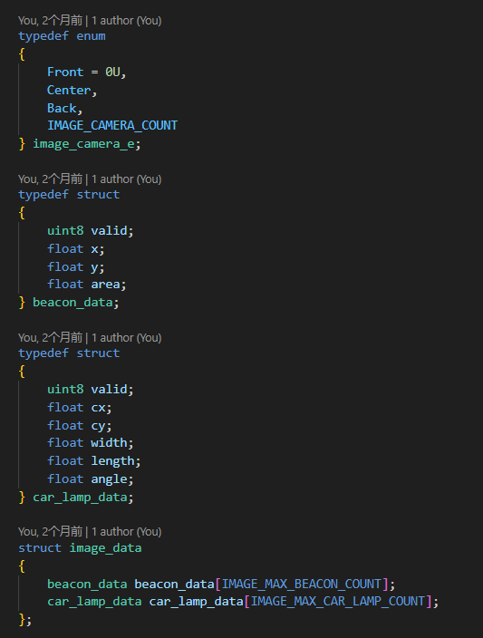

# Camera SPI 与双核 IPC

> 状态：待整合现有设计文档。

现有资料：[飞控和图像板的 SPI 主从通信设计方案](../../doc/飞控和图像板的SPI主从通信设计方案.md)

我为什么使用spi进行通信呢?

1. 当初本来使用3901作为光流的 , 后面换用lc302了,就空闲了一个spi的接口
2. 使用串口的话 就需要占用主机飞控板的2对串口,实在是难以分配的了这些外设资源了
3. 本身3摄像头 , 前和后摄像头是使用2bl3的,然后烧录的也是一模一样的代码,这样肯定更简单一点,然后谁是前谁是后,就由飞控下发来决定
4. 本身就是1对2的通信,那么使用spi来进行就非常合适了
5. spi速度快,虽然图像就100hz,但是能节约一点时间是一点时间

ipc通信拿到了什么?

对于承担绝大部分工作的飞控的核心0,实际上 2块单独的2bl3和飞控的核心1,都干2件事情

1. 采集图像并处理图像,获得自己那个摄像头中的 信标的坐标和车灯的坐标
2. 把坐标数据传送给飞机的核心0

对于我的飞控的核心0,所有的图像数据 都封装在一个结构体里面

这些数据都是负责图像的队友进行视觉识别的 , 后续的车灯融合也好 , 相机模型去畸变 , 路径规划 都是我来进行的

虽然我个人前期也在负责图像算法 , 但后面自从我提出图像上位机离线跑c语言处理算法之后, 同时交给ai迭代算法这个大体思路过后 , 我以为这个实际上就是标记数据集的苦力活而非脑力活了,所以后续的图像算法到底写了啥我也是不清楚,对我也是一个盲盒状态,当然大概率对于负责图像的队友也是盲盒状态,因为也只是纯粹的vibecoding , 导致国赛远远没有达到我控制的60%的水平 ,在决赛的决赛也没有一次跑出好成绩 , 备赛一年也只能运到冠军,是最大的遗憾.

[返回 Air 总文档](../../README.md) · [返回母仓库 README](https://github.com/ZhangStudyLife/HDUASC-SmartCar-21st-FlyOverMinefield/blob/national-2026/README.md)
