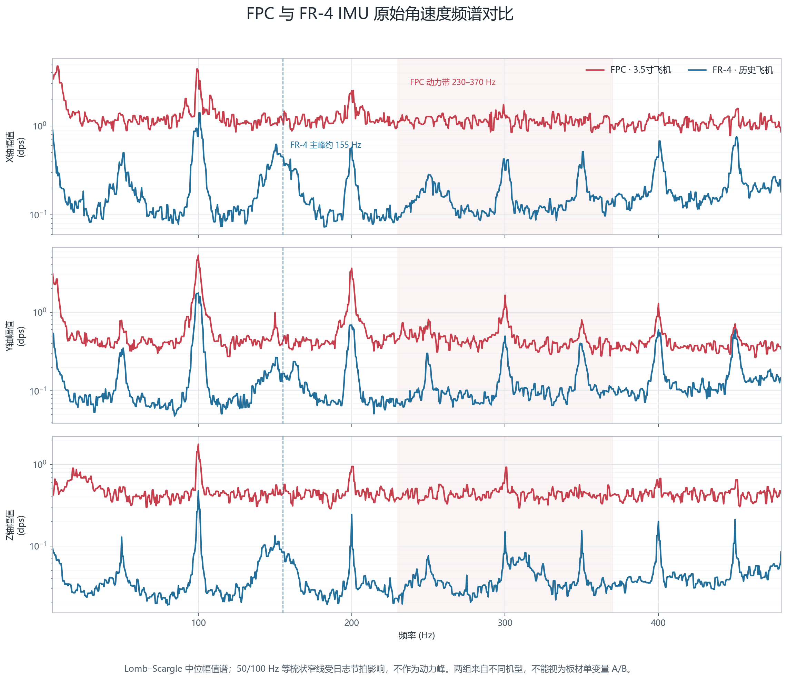
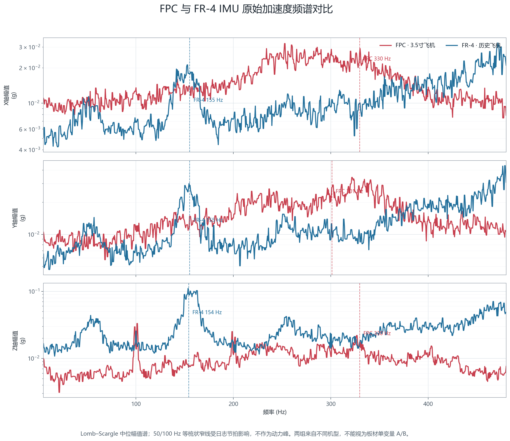

# IMU 与姿态估计

> 状态：待补充正文。

## 文档目标

说明 ICM42688 数据从采集、标定、滤波到姿态估计和控制环使用的完整链路。

## IMU的重要性

对于飞控系统而言 , IMU的物理减震,软件滤波,解算器等的设计是非常非常重要的一环.

对于IMU的选型,我前期从寒假开始,就从BMI088 , ICM42688P等开始研究 , 理论上纸面参数最优秀的应该是42688,但我至今还无法理解为什么还有很多飞控使用mpu6500等老式imu

甚至出现了DJI的品控问题(说是使用42688的dji云台效果不如6500的好)

但是由于寒假期间就开始使用了42688p这款陀螺仪,于是后期就一直没有进行更换

有关于IMU原始数据质量部分,可以参考 [ardupilot.org/copter/docs/common-measuring-vibration.html?utm_source=chatgpt.com](https://ardupilot.org/copter/docs/common-measuring-vibration.html?utm_source=chatgpt.com) 这篇文章

这篇文章讲述了 如何根据原始imu加速度数据分析这个物理减震是否合格等 , 也完全可以采集IMU的日志保存为csv文件,让ai进行分析即可

当然不管是自制fpcimu还是直接使用成品的fr-4的imu模块,经过我的实际测试,这个噪声质量都是符合ap的文档要求的

## FPC 与 FR-4 IMU 频域对比

这里使用两份历史飞行日志进行对比：

- FPC：`全新35自组飞机imu数据.csv`，使用 `I10-I12` 原始角速度和 `I13-I15` 原始加速度。
- FR-4：Git 提交 `1fe56ed` 中 `04250912_主陀螺仪热熔胶直接固定_副陀螺仪使用减震硅胶但是飞线比较硬.csv` 的主 IMU，使用 `I1-I6` 原始六轴数据。

两份日志都以 1 kHz 采集，但存在不同程度的丢帧。分析时按真实时间戳切分连续数据，不跨越大于 20 ms 的断点插值；频谱使用 Lomb-Scargle 方法计算多个动力工作窗口的中位幅值谱，避免把不均匀采样直接当作连续 1 kHz 数据进行 FFT。图中的 50 Hz、100 Hz 及其倍频窄线主要受日志发送节拍影响，不作为电机或机架动力峰。

需要强调的是，这两份数据来自不同飞机和不同飞行过程，并不是只改变 PCB 材质的严格同机 A/B 实验。下面的结果反映的是两套实际硬件方案最终传到 IMU 的振动，不能把所有差异都单独归因于 FPC 或 FR-4 材质。

FPC 所在的 3.5 寸飞机采用高转速动力系统，主要动力振动分布在约 230-370 Hz；历史 FR-4 方案的主要加速度宽峰在约 155 Hz。FPC 的角速度高频幅值反而更高，说明板材和安装结构不能代替针对具体机架、电机和桨叶进行频域分析与滤波器设计。

原始数据在 80-450 Hz 频段内的 RMS 对比如下：

| 数据             |  X 轴 |  Y 轴 |  Z 轴 |
| ---------------- | ----: | ----: | ----: |
| FPC gyro（dps）  | 27.65 |  9.58 | 10.25 |
| FR-4 gyro（dps） |  3.68 |  2.00 |  0.95 |
| FPC accel（g）   | 0.447 | 0.447 | 0.273 |
| FR-4 accel（g）  | 0.299 | 0.367 | 0.833 |

按照 ArduPilot VIBE 的思路，对加速度计去除低频飞行动作后计算振动幅值，其 p95 为：

| 数据 | X 轴（m/s²） | Y 轴（m/s²） | Z 轴（m/s²） |
| ---- | ------------: | ------------: | ------------: |
| FPC  |          6.51 |          7.04 |          4.42 |
| FR-4 |          7.28 |          9.51 |         16.61 |

两套方案的 VIBE p95 都低于 ArduPilot 文档中常用的 `30 m/s²` 参考线。FPC 方案的 Z 轴 VIBE p95 约为 FR-4 的 `1/3.8`，对垂直方向振动的抑制明显；但 FPC 所在小飞机的 230-370 Hz 角速度动力噪声更强，后续仍需要使用与该动力频段匹配的硬件抗混叠、陷波和低通滤波。最终结论不是“某种板材天然全面更优”，而是 IMU 结构、固定方式、飞线约束和整机动力频谱必须一起设计，并且每次更换机架或动力配置后都应重新采集原始六轴数据验证。

## IMU原始数据如何解算出欧拉角

这部分代码可以详细参考我的 CYT4BB7_Air\project\code\Estimation\Attitude 文件夹下的文件 

 我先大致讲一下各个库的意思 

顶层文件是 IMU_TOP , 是对外的直接接口 , 内部1000hz处理 原始数据的采集 , 角速度和加速度的校正 , 角速度和加速度的滤波 , 传入姿态解算器 , 发布欧拉角

滤波器的设计和参数在 IMU_Filtter , 内部处理 传入的新帧的六轴数据 , 维护滤波器结构体的历史 , 输出滤波过后的干净的六轴数据

加速度的校准文件在 Accel_Calibration , 这里主要处理 根据标定的加速度的旋转矩阵和偏置矩阵 , 以1000hz对传入的加速度数据进行矫正 , 同时内含 与wifispi模块使用udp协议进行通信 , 使用上位机进行椭球标定等程序 , 可以把校准的参数存入falsh

姿态解算器采用 魔改Mahony , 实际效果可以达到 无人机实际飞行十几分钟 ,甚至炸机(极大冲击加速度)的情况下 yaw的漂移很小 (一定得把校准做好了)(如果没有视频链接联系我,我是还要放实际效果的视频的,但是我现在临时找不到,所以备注一下). 为什么没用采用更高级的ekf , 因为我认为 1. 仅仅只有六轴数据 , 说白了 这个角度数据 , 要么就是多相信一点瞬时的角速度 , 要么就是多相信一点长期的加速度 , 对于imu本身非重力的真实移动产生的加速度,本身就难以观测,一方面例如光流融合水平加速度,一方面 你的速度估计要用到 水平加速度 (要把重力产生的加速度分量剥夺出来,但是呢在姿态估计的时候本身就是首先对加速度的三轴数据进行归一化算出来的长期的参考角度的) 而且本身我对于这部分的融合还是感觉只是 初窥门径  , 理论上最优的 如果可以结合 GPS , IMU , 光流 , 气压计 , TOF 传感器越多越好 , 然后写成一个总的观测器,互相佐证融合,肯定是更优的(我想的,不保真)

[返回总览](../../README.md)
