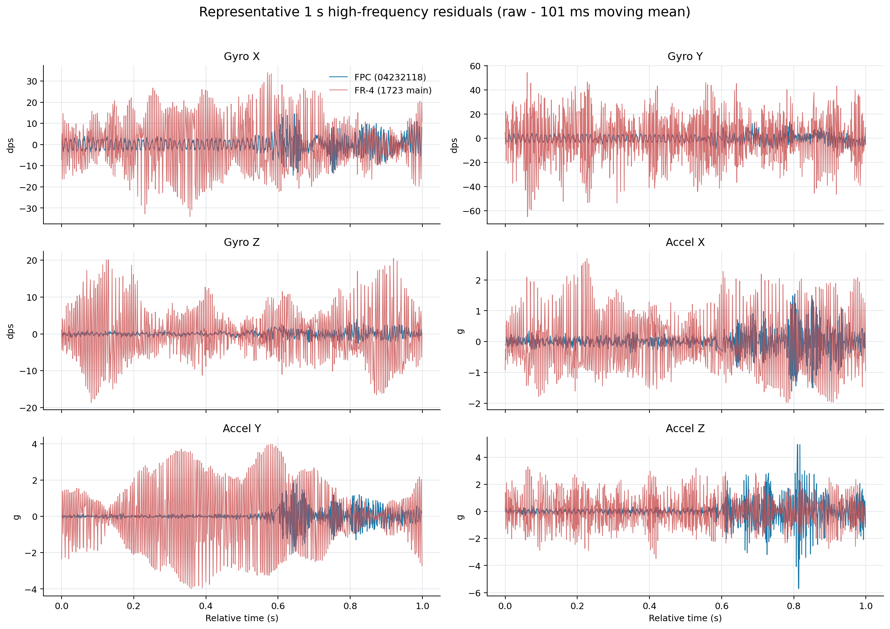
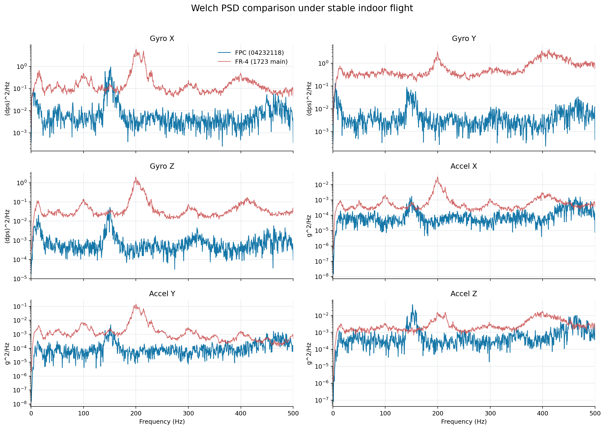
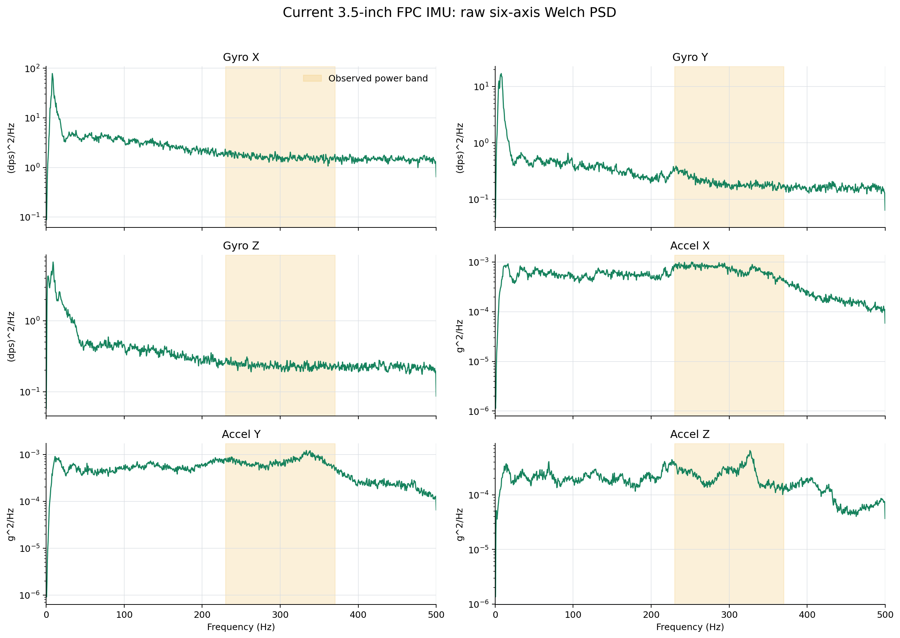

# IMU 与姿态估计

> 状态：待补充正文。

## 文档目标

说明 ICM42688 数据从采集、标定、滤波到姿态估计和控制环使用的完整链路。

## IMU 的重要性

对于飞控系统来说，IMU 的物理减震、校准、软件滤波和姿态解算器都非常重要。这几部分其实是一条完整的链路：物理减震没做好，原始数据里就会有很强的机械振动；原始数据没处理干净，后面的姿态解算和控制环都会受到影响。所以我现在更愿意把它们放在一起看，而不是只讨论某一个滤波器或者某一种解算算法。

对于 IMU 的选型，我从寒假开始先后研究过 BMI088、ICM42688P 等型号。单看数据手册的话，ICM42688P 的纸面参数应该是比较优秀的，但我到现在也没有完全想明白，为什么还有很多飞控在使用 MPU6500 这类更老的 IMU。网上甚至还有一些关于 DJI 云台的反馈，说使用 ICM42688 的版本实际效果不如 MPU6500。这里面到底是 IMU 本身的问题，还是 PCB、减震、滤波和整机调校的问题，我也没有办法直接下结论。

不过我从寒假开始就一直在使用 ICM42688P，驱动、校准、滤波和日志分析也都是围绕它做的，后期就没有再更换。对我来说，选型也不能只看一张参数表。一个器件只要经过实际飞行验证，数据质量能满足要求，而且整套软件链路已经比较稳定，就没有必要为了追求纸面上的“更好”频繁更换。换一个 IMU 看起来只是换一颗芯片，实际上前面的驱动、安装方式、校准数据和滤波参数都要重新验证。

关于 IMU 原始数据质量，可以参考 ArduPilot 的 [Measuring Vibration](https://ardupilot.org/copter/docs/common-measuring-vibration.html) 这篇文章。它主要讲了如何根据原始加速度数据判断飞机的物理减震是否合格。实际分析时，可以把飞行中的 IMU 日志保存成 CSV 文件，再看时域波形、频谱和振动幅值；也完全可以让 AI 帮忙分析这些数据，先把主要频率和可能的问题找出来。

经过我的实际测试，不管是自制的 FPC IMU，还是直接使用成品的 FR-4 IMU 模块，振动幅值都能满足 ArduPilot 文档里的参考要求。但“满足要求”不代表两种方案的频谱完全一样，也不代表可以直接使用同一套滤波参数。具体差异还是要看真实飞行日志，下面就放一下我对这两种方案的实际对比。

## 自制IMU模块的经历

一开始抄IMU模块,是参考开源项目 [oshwhub.com/huashuo0804/icm-42688-tuo-luo-yi-mo-kuai](https://oshwhub.com/huashuo0804/icm-42688-tuo-luo-yi-mo-kuai) 一开始脑子抽了,竟然画的是BTB的,想做成BTB的IMU模块,这样避免拔插,记忆非常深刻,在大二上学期期末周的时候,我那个时候貌似是复习复变函数的前两天,没忍住,开始通宵画板,第一块板子视频链接([b23.tv/h0edsa5](https://b23.tv/h0edsa5)) , 后续由于BTB排座和IMU封装过于难以焊接,并且本身赛题重点还是调飞机,于是我就没管这一块了,索性校赛后硬件队友终于电调稳定了一段时间,有空去画fpc了的小板了,因为本身画起来难度不高,就是imu的ic的引脚引出spi通信接口就行了,所以一板成了,然后我实际飞行测试确实稳定很多(一方面是数据上可以看到噪声小了很多,一个是用了fpc的数据进行飞行,当初速度环的稳定性高的离谱,几乎就是指哪打哪)

## FPC 与 FR-4 IMU 时域与频域对比

这里恢复的是当时真正用于判断 FPC 效果的两份历史日志：

- FPC：Git 提交 `6a56e28` 中的 `0423_raw/04232118.csv`，即全新 FPC 安装方式后的主 IMU 原始六轴数据。
- FR-4：Git 提交 `a3ec7c0` 中的 `1723_直接热熔胶把IMU固定在机架上,飞线给的热熔胶很多.csv`，取当时用于飞控的 FR-4 主 IMU 原始六轴数据。

两份日志都是 ICM42688P 以 1 kHz 采集、室内稳定飞行的数据。为了把真实姿态变化与机械高频振动分开，沿用当时的分析口径：用原始数据减去 `101 ms` 滑动均值，将剩余部分作为高频残差。下图分别取两份日志中具有代表性的 `1 s` 窗口，可以直接看到 FPC 方案的角速度和多数加速度轴曲线明显更薄。

对全部有效飞行数据计算高频残差标准差，结果如下：

| 原始数据    |             FPC X / Y / Z |            FR-4 X / Y / Z |             FR-4 / FPC |
| ----------- | ------------------------: | ------------------------: | ---------------------: |
| Gyro（dps） |    `4.04 / 2.69 / 1.17` |  `12.46 / 18.73 / 6.47` | `3.08 / 6.97 / 5.52` |
| Accel（g）  | `0.380 / 0.380 / 0.987` | `0.755 / 1.560 / 1.275` | `1.98 / 4.10 / 1.29` |

这就是以前分析中“FPC 原始数据幅值降低约三到七倍”的来源：它对应的是三轴角速度高频残差，而不是把不同飞机任意选取的某个频段 RMS 放在一起比较。加速度 X、Y 轴也有明显改善，Z 轴改善相对有限，说明竖直方向的动力振动仍然需要继续依靠结构减震和软件滤波处理。

下面使用相同有效数据计算 Welch 功率谱密度。FR-4 方案在约 `200 Hz` 和 `400 Hz` 附近存在更强的宽频振动；FPC 方案的整体谱底明显降低，但在约 `150 Hz` 仍能看到局部峰值。FPC 并没有让机械振动消失，而是让传入 IMU 的大部分高频能量显著下降。

需要说明的是，这仍然不是只替换 PCB 材质、其他条件完全不变的严格实验。当时同时调整了 FPC 结构和固定方式，因此准确结论应当是“自制 FPC IMU 与新安装方案组成的整体方案优于此前 FR-4 主 IMU 方案”，不能把全部改善只归因于 FPC 材料本身。

### 更换 3.5 寸机架后的重新分析

后续换到 300 g、2004 3000 KV 电机的 3.5 寸飞机后，我又使用 `全新35自组飞机imu数据.csv` 重新分析了同一套 FPC IMU 方案。该日志的 `I10-I12` 是原始角速度，`I13-I15` 是原始加速度。按真实时间戳分段计算后，主要动力振动带已经移动到约 `230-370 Hz`，和此前大飞机上的约 `150-200 Hz` 峰值明显不同。

历史高振动段中，`80 Hz` 以上原始角速度 RMS 为 `30.90 / 11.08 / 11.61 dps`，经过当时的软件滤波后降为 `2.86 / 1.35 / 1.48 dps`。这个结果不能拿来反推 FPC 比 FR-4 更差，因为飞机重量、电机 KV、桨叶和动力工作区间都已经改变；它说明的是每次更换机架或动力系统后，都必须重新采集原始六轴数据，不能直接照搬上一架飞机的陷波和低通参数。

## IMU 原始数据如何解算出欧拉角

这部分代码可以直接参考 [`Attitude`](../../project/code/Estimation/Attitude/) 文件夹，我这里先不展开讲每一行代码，只大致讲一下各个文件是干什么的，以及我做这部分时的一些理解。

整个链路其实很直接：读取 IMU 原始六轴数据 -> 校准 -> 滤波 -> 送入姿态解算器 -> 输出欧拉角。这条链路以 1000 Hz 运行，最顶层的对外接口在 [`IMU_TOP.c`](../../project/code/Estimation/Attitude/IMU_TOP.c)。原始数据从这里进入，依次完成加速度校正、角速度和加速度滤波、姿态更新，最后发布 roll、pitch、yaw。想直接看整体流程的话，从 `IMU_Update_1000HZ()` 这个函数往下看就可以了。

滤波器的实现放在 [`IMU_Filtter.c`](../../project/code/Estimation/Attitude/IMU_Filtter.c)，具体参数放在 [`IMU_Filtter.h`](../../project/code/Estimation/Attitude/IMU_Filtter.h)。它每次接收一帧新的六轴数据，维护各个滤波器的历史状态，再输出相对干净的数据。至于为什么要这样设置陷波和低通参数，还是要回到前面说的原始数据频谱上看，不能只因为别人用了某个参数，就直接照抄到自己的飞机上。(这个一般来说,把1khz的原始imu六轴数据发送到上位机,然后让AI分析,用多少参数的陷波啊低通啊就差不多了)

加速度校准主要在 [`Accel_Calibration.c`](../../project/code/Estimation/Attitude/Accel_Calibration.c) 中完成。这里会根据标定得到的偏置和校正矩阵，以 1000 Hz 对加速度数据进行校正，也包含椭球标定、标定结果检查和参数保存到 Flash 等流程。上位机通过 WiFiSPI 和 UDP 发起标定、接收标定状态的接口在 [`wifi_cal_imu.c`](../../project/code/Protocols/wifi/wifi_cal_imu/wifi_cal_imu.c)，整个 WiFi 通信链路可以参考 [`Protocols/wifi/README.MD`](../../project/code/Protocols/wifi/README.MD)。

这里我想多说一句：校准真的比后面换一个更“高级”的算法重要。加速度计的比例、轴间误差或者安装偏差没处理好，算法看到的重力方向一开始就是歪的；陀螺仪零偏没处理好，积分出来的角度也一定会慢慢跑掉。输入的数据本身有问题，后面的解算器再复杂，也只是在更复杂地处理错误数据。

姿态解算器采用的是我自己改过的 Mahony，代码在 [`MahonyAhrs.c`](../../project/code/Estimation/Attitude/MahonyAhrs.c)，主要参数在 [`MahonyAhrs.h`](../../project/code/Estimation/Attitude/MahonyAhrs.h)。实际测试中，无人机连续飞行十几分钟，甚至遇到炸机这种很大的冲击加速度时，yaw 的漂移仍然比较小。当然，这个结果有一个很重要的前提：一定要先把校准做好。六轴 IMU 本身没有磁力计或者其他绝对航向参考，所以这里说的是我这套飞机在实际测试时间内漂移较小，并不是说六轴算法能够真正观测到绝对 yaw。

> 实际效果的视频我还在找，后面找到会把链接补在这里。如果开源后这里还是没有视频，也可以联系我提醒一下。

为什么没有采用看起来更高级的 EKF？我目前的理解是，手里只有六轴数据时，本质上还是在角速度和加速度之间分配信任：短时间内更相信陀螺仪积分出来的变化，长时间再用重力方向把 roll 和 pitch 拉回来。Mahony 里面做的事情，说白了也是根据当前状态判断“这一帧加速度到底能信多少”。运动比较剧烈、加速度模长明显偏离 1 g 时，就少信一点加速度；接近静止时，再让加速度更多地参与修正。

真正麻烦的地方是，加速度计测到的不只有重力，还有飞机真实运动产生的加速度。只看一帧六轴数据，很难分清其中多少来自重力、多少来自水平运动。姿态估计想从加速度里找重力方向，速度估计又需要先把重力分量从加速度里剥掉，这两件事本身就是互相牵连的。所以在只有六轴数据的前提下，换成 EKF 并不会凭空多出新的观测量，反而还会增加建模、调参和排查问题的成本。对我现在这套系统来说，先把一个结构简单、行为清楚的 Mahony 调好，实际收益更直接。

当然，我对多传感器融合也只是初窥门径。理论上如果能把 GPS、IMU、光流、气压计、TOF 等数据放进一个总的观测器，让它们从不同方向互相佐证，肯定会比只靠六轴 IMU 更完整。例如光流和 GPS 可以给水平运动提供额外约束，气压计和 TOF 可以给高度提供参考。不过也不是传感器越多就一定越好，时间同步、安装误差、噪声和异常数据如果没处理好，新的传感器也可能带来新的问题。这个方向应该是更优的，但目前更多还是我自己的理解，不保真。

[返回总览](../../README.md)
