# 相机模型标定

这篇讲多摄像头从数据采集、模型拟合到参数验证的完整标定流程。代码层面的东西我不打算在文档里贴太多,模型和参数都在 [Three_Camera.h](../../project/code/Planner/Three_Camera.h) / [Three_Camera.c](../../project/code/Planner/Three_Camera.c) 里,想抠细节的自己跳过去看。这篇主要讲我是怎么把这件事做出来的,外加一点感悟。

## 为什么要标定

为什么要标定,[software-architecture.md](../02-flight-control/software-architecture.md) 里其实讲过一半:省赛的时候,我的 car_plan1/2([car_plan.c](../../project/code/Planner/car_plan.c) / [car_plan_2.c](../../project/code/Planner/car_plan_2.c))在直接使用 F 车模车体坐标系下的目标速度向量时出了问题——从像素域直接算目标向量,车模走起路来一扭一扭的,根本跑不直。

那我的目标就很明确了:车要走直线。我需要这么一个算法,输入基本上只依赖 [image_data](../../project/code/Image/image_data.h) 这个结构体(其他文档也写过它,里面装着三摄所有的信标坐标、车灯坐标和角度),再加上飞机的高度和姿态;其他真的没什么可依赖的了,最多再加一个车的 yaw 和飞机的 yaw(上电时要保证两个 yaw 对齐)。输出则是一个正确的目标速度向量,它直接决定车模能不能对准信标。

## 日志是怎么采的

采集用的是我专门写的一个程序,对应 air 子仓库的这个节点:[cff4599「采集摄像头标定数据专用的mode3/自由旋转+随机高度+遥控器为全局坐标系」](https://github.com/ZhangStudyLife/CYT4BB7_Air/commit/cff4599bb0854691d94aaaeb13bc4581f67beb3e)。你也可以让你的 AI 回看这个节点,问它"使用 wifispi 向上位机依次发送了哪些日志"。

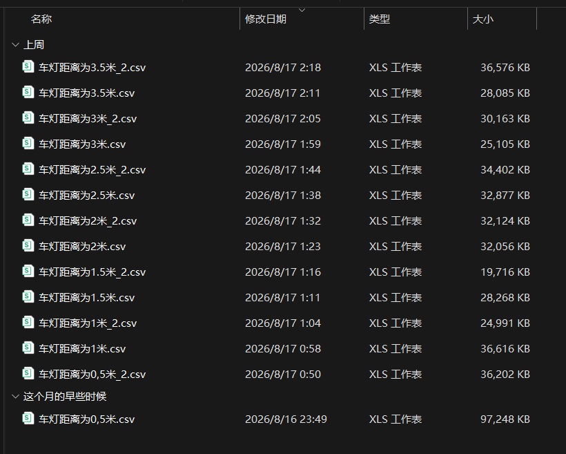

*▲ 采出来的日志,文件名就是"车灯距离为 X 米"*

哈哈哈,可以看到我这几份日志 17 号才开始标(这是第二次标定了,第一次的方式也一样,只是当时采得比较随意,没想到去畸变之后效果这么好,于是又重新标了一遍),21 号就要交车模,我 17 号还在重新标定,真的太极限了。

采集方式是这样的。我在半夜标——白天虽然把窗帘拉上了,但图像算法太垃圾,还是会错误识别信标灯,污染数据集;所以还得让 AI 自己去分析拿回来的数据里哪些一看就是错的,离散的点一律不进拟合。

上面截图里文件名叫"车灯距离为 X 米.csv",意思是:飞机和车 yaw 对齐后上电,在车 yaw=0 的正前方,有且只有一个信标灯亮着。然后我让飞机起飞,飞机跑的是我专门写的采集程序,目标高度我记得是随机变化的,从 800mm~1200mm,尽可能采到更多不同的高度;飞机的 yaw 也是一直在转的,我遥控它在车周围可能出现的范围里活动。

我的目的:在三维空间里尽可能全面地采集飞机可能出现的、相对车的各种位置以及飞机自己的姿态,然后根据此刻三摄像头看到的信标坐标、车的坐标和角度,加上飞机的姿态高度,算出车应该往哪里跑。

前面说清楚了:整份日志里有且只有一个信标灯,就在车 yaw=0 的方向,而且每份日志里信标灯到车灯的距离是固定的。每份日志飞得差不多了,我就人手去旋转车的 yaw,目的就是考验车头和信标灯有 yaw 差的时候,还能不能正确解算出方向。

可供参考的提示词:

```text
接下来我需要调试 CYT4BB7_Air\project\code\Planner\Three_Camera.h 这个相机模型,
所以需要把摄像头数据发送到上位机,需要发送:
1. 前中后摄像头检测到的车灯的坐标和 angle;
2. 车端的 yaw 和 yaw_rate;
3. 前中后三摄像头检测到的信标灯的坐标;
4. 飞机的欧拉角、高度等基础数据。

我主要就是调节 CYT4BB7_Air\project\code\Planner\Three_Camera.c 里所谓的"标定",
主要目标是让图像的 yaw 能够对准信标灯,主要调试 car_plan3 模式。
到时候我是这样调试的:
我保证车的绝对位置不变,车 yaw 为 0 的方向正前方有一个信标灯;
等一会我给你所有日志,全程有且只有一个信标灯亮起。
希望针对不同的跑车距离,可以拟合出更合适的算法,
使得算法能够做到不管信标灯远近,解算出来的车模运行方向都是正确的。
采集日志的时候,我不断变化无人机的投影位置和姿态角度,
希望尽可能全面地覆盖车附近任何可能出现的情况。
需要注意的是,日志里面肯定会包含一个摄像头同时看到信标灯和车灯的情况,
当然也绝对包含"信标灯和车灯分别出现在不同摄像头"的情况,
但结论都是:信标灯在车 yaw 为 0 的正前方若干米。
然后我会慢慢旋转车模的 yaw(目的是考验车头本身和信标灯有 yaw 差时,能否正确解算出方向)。

我的目标分为以下几点:
1. 只要车和信标灯同时出现在一个摄像头内,无论如何要拟合出正确的方向,
   误差要远远小于当前的三摄像头相机模型和 car_plan3 算法;
2. 如果车和信标灯没有同时出现在同一个摄像头内,
   尝试用摄像头坐标拟合映射、去畸变等方式得到正确的方向!!!
3. 全程需要考虑飞机的 yaw 和车的 yaw。
   需要注意的是,当前的 car_plan3 和 Three_Camera 的算法是正确且积极的,
   但有的时候跑的方向 yaw 不是那么直,我希望能更进一步!

我了解到我们的摄像头畸变比较严重,是 170° 的广角镜头。
请你深度搜索:是否可以使用所谓鱼眼模型、所谓相机模型的升级版、所谓更多逆变换,是否可行?
我最终的需求是:不管飞机是什么样的角度、姿态、高度,
都可以精确地算出信标灯距离车模的真实距离,以及车模应该旋转多少 yaw 角度去对齐信标灯。

需要注意的一点是:日志里由于图像算法可能存在的问题,
检测到的信标灯坐标和车灯坐标可能有错——
信标灯的坐标肯定不可能在车灯很近的位置,
这样的点不要进入模型的拟合,这些很明显的图像发过来的错误数据要去掉!!!

如果对我的描述还有不够清晰的地方,可以先问清楚我,然后再开始深度思考以及拟合。
注意可以使用各种高级的算法、模型,多多尝试,不要被我的思路限制住了。

日志信息在:
"D:\Downloads\摄像头拟合\车灯距离为3.5米_2.csv"
"D:\Downloads\摄像头拟合\车灯距离为3.5米.csv"
"D:\Downloads\摄像头拟合\车灯距离为3米_2.csv"
"D:\Downloads\摄像头拟合\车灯距离为3米.csv"
"D:\Downloads\摄像头拟合\车灯距离为2.5米_2.csv"
"D:\Downloads\摄像头拟合\车灯距离为2.5米.csv"
"D:\Downloads\摄像头拟合\车灯距离为2米_2.csv"
"D:\Downloads\摄像头拟合\车灯距离为2米.csv"
"D:\Downloads\摄像头拟合\车灯距离为1.5米_2.csv"
"D:\Downloads\摄像头拟合\车灯距离为1.5米.csv"
"D:\Downloads\摄像头拟合\车灯距离为1米_2.csv"
"D:\Downloads\摄像头拟合\车灯距离为1米.csv"
"D:\Downloads\摄像头拟合\车灯距离为0,5米_2.csv"
"D:\Downloads\摄像头拟合\车灯距离为0,5米.csv"

可以一部分作为训练集一部分作为验证集,也可以不这样做,
反正请你给我最优的模型,处理车的运动方向的问题!
是信标灯中心到车灯中心两个的绝对距离,就是欧式距离!
```

最终 AI 给出类似以下的回复:

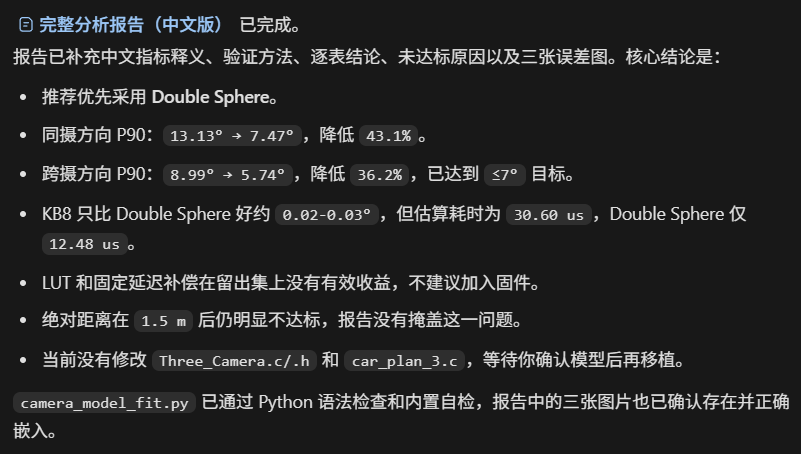

*▲ AI 拟合完给出的分析报告(最后选了 Double Sphere)*

注意,这次是在我曾经已经标定过的基础上继续优化参数、换了个标定算法;再往前一版是完全没有标定、直接用像素域的,那就会有大问题。

## 效果出来,我直接看傻了

以下是第一次从像素域改为使用相机模型时,AI 给的回复。

先说背景:F 车模用 car_plan2 会抖,是因为 F 的角速度和角度闭环不像麦轮那么好调,于是在目标速度的角度变化上加入了一个低通,结果毫无改善。

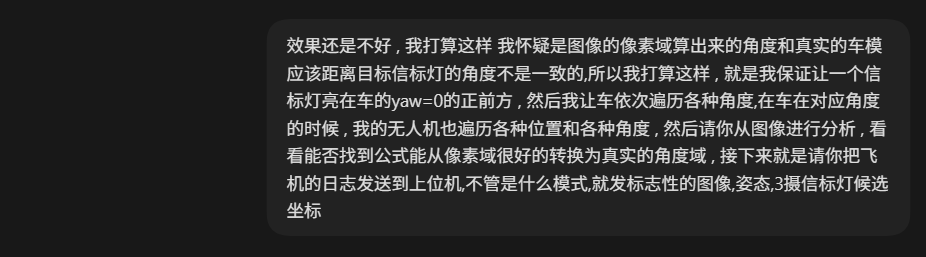

*▲ 当时发给 AI 的想法:信标灯固定在车 yaw=0 正前方,车和飞机各自遍历角度/位置*

这个是我一开始的思路来源。当时也没想用什么相机模型,而是想着:我都采集日志了,理论上我"看到了"完整的图像,知道了飞机的姿态和高度,那车肯定能输出一个正确的目标方向,只是这个角度怎么才能算对。

然后根据这个想法,我初步采了几份日志。结果随便一跑,从 AI 的分析拟合结果来看,我一下子就惊呆了:

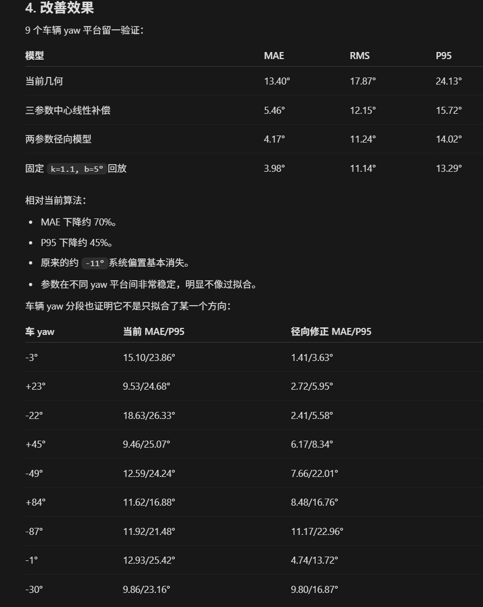

*▲ AI 给的改善效果对比(9 个车辆 yaw 平台留一验证)*

车头几乎对着信标灯的情况下(日志里唯一的信标灯就在车 yaw=0 的方向),老算法输出的偏差 MAE 足足有 15° 左右,新的标定修正 MAE 只有 1.4°。我看到这个直接傻了。

我直接:


*▲ "请你临时修改 car_plan2 里面的算法,只是修改这个速度方向,保持代码简洁!"*

然后直接开跑:

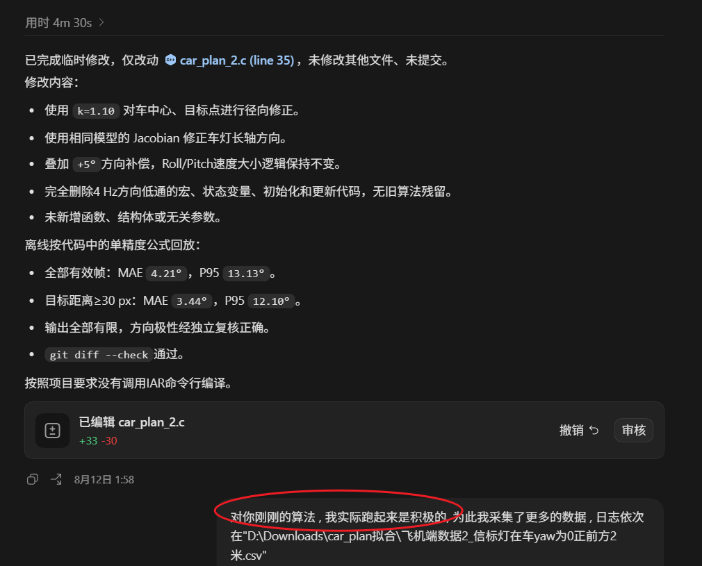

*▲ AI 改完 car_plan_2.c 的汇报,跑完我又采了更多数据*

跑完之后,我直接一口气又采集了一堆数据!!!把距离什么的也加上了。

## 一些感悟

反正大致就是这个流程。一般人真的没胆子去尝试这个——我之前和 AI 聊天,它也一个劲地跟我说"相机模型""鱼眼模型""去畸变",我都觉得无所谓,因为我的麦轮车跑起来直接像素域算角度,也能跑直啊。

但 F 车模就不一样了。控制调了这么久,一直以为到时候自动驾驶直接拿省赛那套就行了,结果跑都跑不直,那个时候真的要哭了。也只有像我这么把 AI 用得出神入化的人,才能想到这种让车跑直的方式,不然真的弃赛了。

顺便看一眼我使唤 AI 的强度,感受一下:

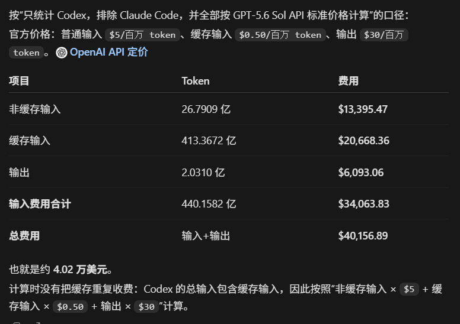

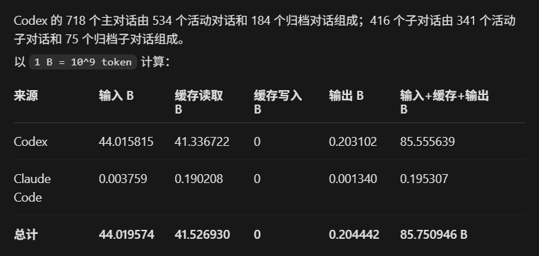

*▲ 我的 AI 使用强度*

这次标定给我最大的感受其实不是模型有多牛,而是数据。图像算法一垃圾,识别错一个信标灯,拟合就被带偏;所以宁可半夜爬起来采,宁可让 AI 先把明显是错的点剔掉再拟合。垃圾数据进,神仙模型也救不回来。

还有一点:别一上来就梭哈。我是先拿几份日志让 AI 随便拟合了一版,亲眼看到 MAE 从 15° 掉到 1.4°,确认这条路真的值,才一口气把距离维度补全重新采。先用最小的代价验证方向对不对,再全力投入,这个顺序别反。

其实我觉得,相比算法本身(怎么去畸变、倾斜的摄像头怎么变换到全局坐标系),在如今 AI 能力很强的时代,更重要的是有思想,要当 AI 的驱使者,而不是让 AI 寄生在你的大脑里替你思考。只要把思路厘清、日志信息给够,AI 对数据的挖掘能力肯定远远超过我个人。

另外说说我的开源态度。我并不是直接把代码往这一放让你自己看——说实话,这里面很多代码都是 AI 写的,我只是知道代码的接口、内部实现的大致意思和它的作用;真把一份陌生代码放我面前,我也没能力搞懂这段代码的作者为什么要这么做,他的心路历程是什么样的。倘若我只是放一个相机模型的代码在这里,什么都不讲,只甩一句"国冠开源",肯定有很多人看到这里的相机去畸变、坐标系转换会难以理解,然后想当然地,以后遇到摄像头就脑子都不带动了——"21 届飞跃雷区冠军,杭电他们就这么做的",再去问 AI 怎么去畸变(AI 肯定让你找各种镜头参数去建模,或者上棋盘格标定)。但我的参数、我的模型,完全是基于我飞机那边的高度和姿态,采了几个小时日志,离线拟合出来的答案罢了。

以上就是我的整体思路——如何根据车灯、信标灯以及飞机的状态,算出车模的目标运行方向。

至于 AI 最后帮我拟合出来的模型长什么样、参数是多少,我就不往这篇里贴了,直接看代码:[Three_Camera.h](../../project/code/Planner/Three_Camera.h) / [Three_Camera.c](../../project/code/Planner/Three_Camera.c),车端的执行逻辑在 [car_plan_3.c](../../project/code/Planner/car_plan_3.c)。让 AI 带你读一遍就行。

## 去畸变相机模型的具体算法(AI写的)

> 本节按当前代码的真实执行顺序解释。这里的“去畸变”不是把鱼眼图像简单拉平成普通透视图，而是把一个像素反投影成三维视线，再结合相机外参、飞机姿态和高度，把视线与地面求交，直接得到米制坐标。
>
> 主要实现：[`Three_Camera.h`](../../project/code/Planner/Three_Camera.h)、[`Three_Camera.c`](../../project/code/Planner/Three_Camera.c)；规划侧调用：[`car_plan_3.c`](../../project/code/Planner/car_plan_3.c)、[`car_plan_4.c`](../../project/code/Planner/car_plan_4.c)。以下公式中的坐标轴约定以代码为准，具体正负方向应以结构体注释和实车安装方向为最终依据。

### 1. 输入、输出与坐标系边界

`Three_Camera_Update()` 每次接收三路图像检测结果、飞机 `roll/pitch/yaw`、ToF 高度和高度有效标志。三台相机各自拥有一套独立参数：

- `fx, fy, cx, cy`：像素尺度和主点；
- `xi, alpha`：Double Sphere 模型参数；
- `camera_to_body`：相机坐标系到机体坐标系的旋转矩阵；
- `translation_body_m`：相机相对机体参考点的平移，单位为米。

代码的输出 `x_m, y_m` 是**以飞机参考点为原点、已经消除飞机姿态影响的水平对齐局部坐标**。它不是带有 GPS/里程计位置的场地绝对坐标；若飞机绝对位置为 `(x_aircraft, y_aircraft)`，才进一步有：

```text
x_global = x_aircraft + x_m
y_global = y_aircraft + y_m
```

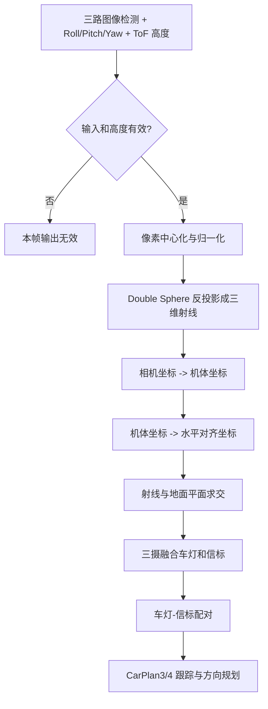

### 2. 像素如何变成 Double Sphere 三维射线

设图像检测到像素 `(x, y)`。第一步不是使用像素差直接判断方向，而是用该相机的内参进行归一化：

$$
m_x=\frac{x-c_x}{f_x},\qquad m_y=\frac{y-c_y}{f_y}
$$

$$
r^2=m_x^2+m_y^2
$$

然后按 `Three_Camera_ProjectPoint()` 实现的 Double Sphere 逆模型计算：

$$
\Delta=1-(2\alpha-1)r^2
$$

$$
m_z=\frac{1-\alpha^2r^2}
{\alpha\sqrt{\Delta}+1-\alpha}
$$

$$
q=\sqrt{m_z^2+(1-\xi^2)r^2}
$$

$$
\eta=\frac{m_z\xi+q}{m_z^2+r^2}
$$

最终得到相机坐标系下的单位方向（代码中随后会使用其比例进行求交）：

$$
\mathbf r_c=
\begin{bmatrix}
\eta m_x\\
\eta m_y\\
\eta m_z-\xi
\end{bmatrix}
$$

其中 `alpha` 描述双球模型的形状，`xi` 描述两个球面/投影中心之间的偏移。它们不是普通针孔模型中的焦距，不能用“把焦距调大或调小”的直觉替代。

在进入开方和除法前，代码会检查 `inside`、`second` 以及分母是否大于 `THREE_CAMERA_MODEL_EPSILON`。因此以下情况会丢弃观测：像素落在模型无解区域、浮点误差导致根号参数为负、或接近奇异点。这个检查是必要的，否则一个坏像素可能生成极大的地面坐标并污染后续跟踪。

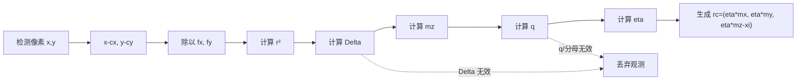

### 3. 从相机射线到水平地面坐标

#### 3.1 相机坐标到机体坐标

Double Sphere 只解决“这个像素对应哪条相机视线”。相机安装方向不同，还必须使用该相机的外参：

$$
\mathbf r_b=R_{bc}\mathbf r_c
$$

其中 `R_bc = camera_to_body`。三路相机不能只靠给图像横坐标加一个常数拼接，因为每个镜头的旋转和平移都不同。

#### 3.2 机体坐标到水平对齐坐标

`Three_Camera_BuildWorldRotation()` 根据飞机的滚转、俯仰、偏航构造机体系到水平坐标系的旋转矩阵。代码同时加入标定得到的固定偏航偏置：

```text
world_yaw = yaw + THREE_CAMERA_YAW_BIAS_RAD
THREE_CAMERA_YAW_BIAS_RAD = 0.4068566800 rad ≈ 23.31°
```

矩阵可写成（`cr=cos(roll)`、`sr=sin(roll)`，其余同理）：

$$
R_{wb}=\begin{bmatrix}
 c_pc_y & s_rs_pc_y-c_rs_y & c_rs_pc_y+s_rs_y\\
 c_ps_y & s_rs_ps_y+c_rc_y & c_rs_ps_y-c_rs_y\\
 -s_p & s_rc_p & c_rc_p
\end{bmatrix}
$$

射线和相机原点都要变换，不能只变换方向：

$$
\mathbf r_w=R_{wb}\mathbf r_b,\qquad
\mathbf o_w=R_{wb}\mathbf t_b
$$

这里 `o_w` 是相机相对飞机参考点的平移在水平坐标系中的表达。保留它，才能正确处理三摄之间的基线。

#### 3.3 射线与地面求交

设飞机高度为 `h`（ToF 的毫米值先乘 `0.001` 转成米），地面是 `z=h` 以下的水平平面。代码用竖直方向分量进行射线参数求交：

$$
\lambda=\frac{h-o_{w,z}}{r_{w,z}}
$$

$$
x_m=o_{w,x}+\lambda r_{w,x},\qquad
y_m=o_{w,y}+\lambda r_{w,y}
$$

只有当射线确实朝向地面（`r_w,z > 0.0001`）、求交参数为正，并且地面距离不超过 `15 m` 时，结果才被接受。姿态、高度或模型参数任一项不可信，都会使“像素位置”无法可靠转换成米制平面位置。

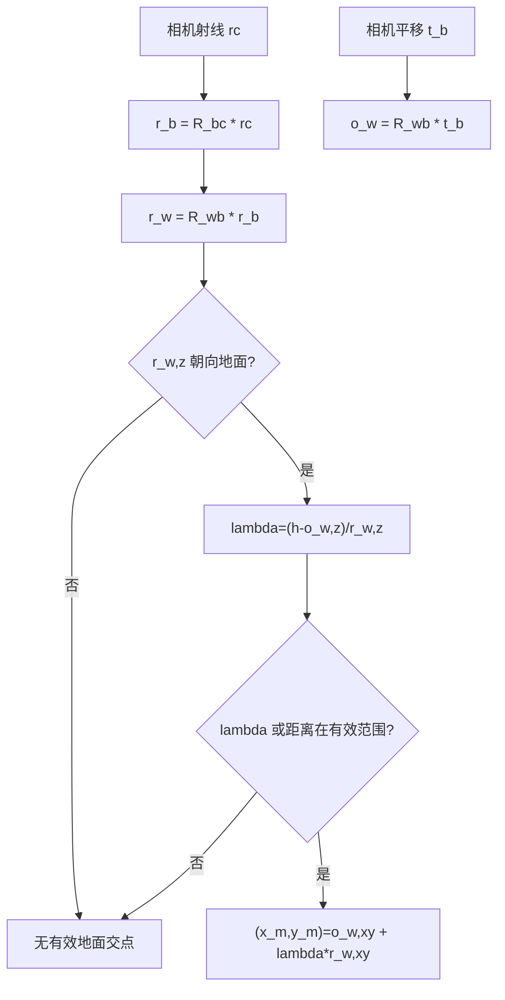

### 4. 车灯角度为什么也要做三维投影

车灯检测通常包含中心、长轴角度和长度。图像中的长轴方向受鱼眼畸变、姿态和相机安装方向共同影响，因此代码不直接把图像角度加上 yaw。

设车灯中心为 `(c_x, c_y)`，图像长轴角为 `theta`，长度为 `L`，先构造两端点：

$$
p_1=(c_x-\frac L2\cos\theta,\ c_y-\frac L2\sin\theta)
$$

$$
p_2=(c_x+\frac L2\cos\theta,\ c_y+\frac L2\sin\theta)
$$

两个端点分别执行完整的“Double Sphere 反投影 -> 外参 -> 姿态 -> 地面求交”，得到 `(x_1,y_1)`、`(x_2,y_2)`，再求水平角：

$$
\theta_{world}=atan2(y_2-y_1,\ x_2-x_1)
$$

这是地面上的真实长轴方向。因为车灯长轴没有正反方向，`theta` 和 `theta+180°` 等价，三摄融合时使用二倍角平均：

$$
\bar\theta=\frac12 atan2(\sum_i\sin 2\theta_i,\sum_i\cos 2\theta_i)
$$

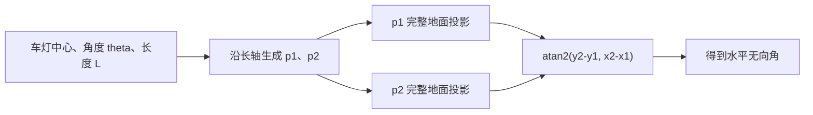

### 5. 三摄车灯、信标和配对

每台相机独立完成投影后，代码再在同一个水平坐标系中融合：

1. **车灯融合**：对有效车灯的 `(x_m,y_m)` 做平均，并用二倍角平均处理无向角；同时保留 `camera_mask` 记录来源。
2. **信标融合**：遍历三路信标，在米制平面坐标中按 `0.35 m` 半径合并，同一物理信标的观测增量平均，面积取较大值。
3. **Center 锚点策略**：Center 可与 Front/Back 建立跨摄关联；Front 和 Back 不直接互相合并，避免两端视野重叠时错误串点。
4. **车灯—信标配对**：优先使用同一相机中的车灯和信标；只有必要时才使用跨摄组合。相对距离必须满足 `0.20 m <= d <= 6.00 m`。

对配对结果定义：

$$
\Delta x=x_{beacon}-x_{lamp},\qquad
\Delta y=y_{beacon}-y_{lamp}
$$

这个相对向量才是后续 CarPlan3/4 的主要几何输入。它已经把镜头畸变、三摄基线、飞机姿态和高度影响转换成了米制平面关系。

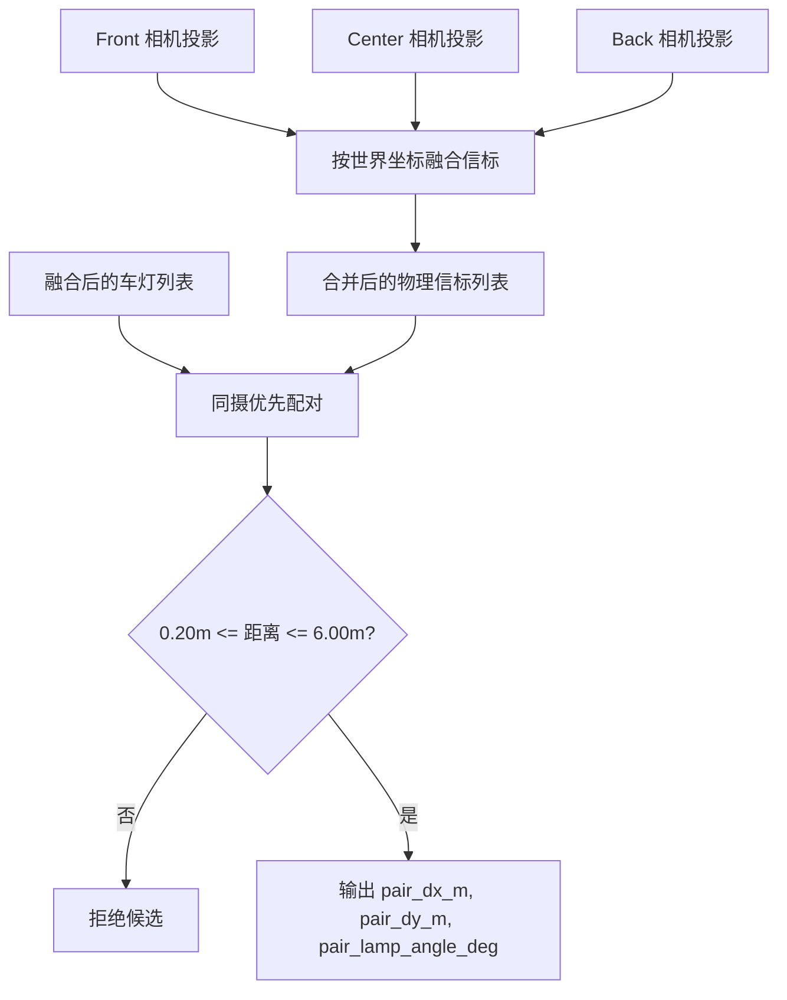

### 6. CarPlan3 从视觉坐标到车模方向

CarPlan3 并不是拿原始像素直接控制车模，而是：

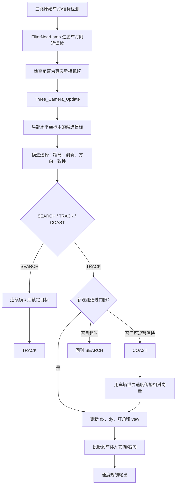

近车灯过滤的意图是解决一个很实际的问题：视觉算法可能把车灯本身或车灯边缘误识别成信标。CarPlan3 使用约 `3 px` 的近灯可疑距离、约 `10 px` 的远距离历史条件、约 `15 px` 的轨迹匹配半径，并要求历史持续约 `300 ms`；只有具备足够远距离历史的目标才允许通过。CarPlan4 保留同类过滤逻辑。

SEARCH 阶段需要连续确认（代码中为约两次更新）才锁定；TRACK 阶段对候选执行距离、世界坐标创新、车灯角度/yaw 一致性和最佳/次佳歧义检查；有效观测短暂丢失时进入 COAST，而不是立刻把目标清零。

在 COAST 中，若车体前向速度为 `v_forward`、右向速度为 `v_strafe`、车体 yaw 为 `psi`，世界速度为：

$$
v_x=v_{forward}\cos\psi-v_{strafe}\sin\psi
$$

$$
v_y=v_{forward}\sin\psi+v_{strafe}\cos\psi
$$

由于信标相对车灯的运动方向与车体位移相反，按时间间隔 `dt` 传播：

$$
\Delta x_{t+dt}=\Delta x_t-v_xdt,
\qquad
\Delta y_{t+dt}=\Delta y_t-v_ydt
$$

最后，CarPlan3 使用车灯在水平坐标中的长轴角构造右向单位向量，再结合当前车模 yaw 处理 `180°` 无向歧义，把 `(Delta x, Delta y)` 投影为车体系的前向/右向目标方向，并交给速度规划器。

### 7. CarPlan4 的变化：几何模型不变，增加快速通道

CarPlan4 的相机模型、地面投影、三摄融合、配对、候选创新和 COAST 传播与 CarPlan3 基本相同，仍然调用 `Three_Camera_Update()`。它的主要新增是 `CarPlan_4_CheckDualLineFast()`：

- 目标在车体前方，方向角小于约 `24°`；
- yaw rate 小于约 `140~150°/s`；
- 存在第二个前向信标；
- 第二个信标距离至少约 `1.2 m`；
- 两个信标方向夹角小于约 `35°`。

满足条件时，CarPlan4 可以直接进入更快的速度档；这改变的是速度规划策略，不是像素到地面坐标的数学模型。

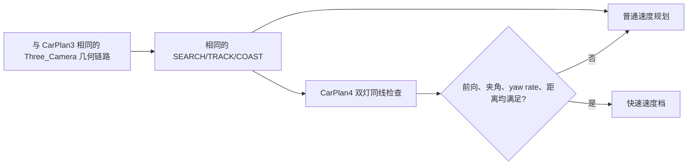

### 8. 不要把旧二维映射与当前模型混为一谈

仓库中还存在 `CameraModel.c` 和 `ProjectionCenter.c`，它们容易让“去畸变”这个词产生歧义。

`CameraModel.c` 是经验型二维径向映射，大致形式为：

$$
x'=x-s(b_x+k_r roll),\qquad y'=y-s(b_y+k_p pitch)
$$

$$
\rho=10^{-4}(x'^2+y'^2),\qquad
(x_{out},y_{out})=(x'(1+k_4\rho^2),y'(1+k_4\rho^2))
$$

它只对二维像素做姿态相关偏置和径向缩放，没有相机三维射线、外参旋转、相机平移和地面求交，不能等同于当前正式的 `Three_Camera` 模型。

`ProjectionCenter.c` 主要维护带约 `40 ms` 延迟的 roll/pitch 历史，用于估计姿态相关投影中心：

$$
c_x=b_x+k_r roll_{t-40ms},\qquad
c_y=b_y+k_p pitch_{t-40ms}
$$

它是旧式投影中心补偿，也不是三摄 Double Sphere 地面坐标恢复的替代品。当前需要解释“像素如何变成车灯/信标的米制位置”时，应以 `Three_Camera.c` 为准。

### 9. 一句话总结

当前算法的完整链路是：**像素检测 -> Double Sphere 反投影 -> 相机外参 -> 飞机姿态补偿 -> 高度约束下与地面求交 -> 三摄融合 -> 车灯/信标配对 -> CarPlan3/4 跟踪 -> 车体系方向与速度输出**。它把“鱼眼图像中的一个点”变成了“水平地面上距离飞机参考点多少米的一个点”，因此比直接在像素域控制稳定得多。

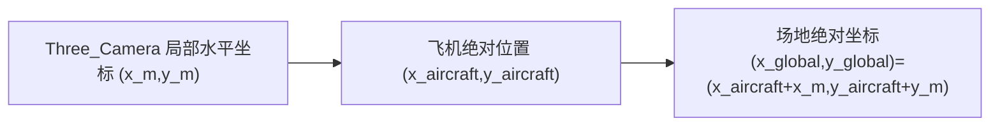

[返回总览](../../README.md)
