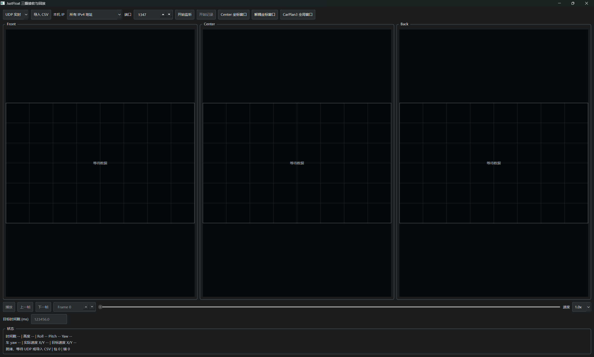

# CarPlan3 与上位机调试流程

> 建议先看这个视频：[开源文档链接视频]上位机调试路径规划和图像兜底（[Bilibili 视频](https://www.bilibili.com/video/BV1Rm4m6fEMv/)）。可以先直观看一下上位机如何实时调试和回放，后面再看具体的数据流和文件结构。

CarPlan3 这部分调起来比较痛苦，主要有两个原因：一个是三路摄像头本身就不太好调，另一个是我又加了相机模型，要把图像里的像素映射到全局坐标系。

所以路径规划到底应该用什么阈值、什么算法，不能只靠“改一个参数，然后看车跑得像不像”。车跑歪了，可能是图像检测错了，也可能是相机模型算错了，还可能是路径规划输出没问题，但车模底盘根本没跟上。只看车最后跑出来的结果，基本分不清到底是谁写的代码有问题。

我最后采用的办法是：把调试时能看到的关键数据尽量全部记录下来，再在上位机里把当时的图像坐标、全局坐标和车模状态重新画出来。这样就算车已经跑完了，也可以回放当时每一帧发生了什么。

## 先说结论：这不是普通的闭环调参曲线

WiFi SPI 的基本用法可以参考[《WiFi SPI 调试》](../03-communication/wifi-spi-debugging.md)。我这里的 WiFi SPI 走 UDP 通道，使用 JustFloat 协议把数据发送到电脑；如果只是看姿态、PID 之类的浮点曲线，用 VOFA+ 就够了。

但 CarPlan3 不是这种“看一条曲线，然后调一个 PID”的问题。路径规划里有三路图像、目标点、车灯角度、飞机姿态和高度，很多数据之间还有空间关系。只看曲线看不出“这个信标到底是不是车灯旁边的那个信标”，也看不出三路摄像头融合之后的点有没有跳到奇怪的位置。

因此这里需要一个专门的可视化工具，实时查看和回放 `image_data`。`image_data` 是什么，可以先看[《Camera SPI 与双核 IPC》](../03-communication/camera-spi-and-ipc.md)以及 [`image_data.h`](../../project/code/Image/image_data.h)：它里面放着 Front、Center、Back 三路摄像头检测到的信标和车灯结果。相机模型和三摄融合的背景，可以继续看[《相机模型标定》](camera-model-calibration.md)。

## 整体数据流

整个调试链路大概是这样：

```text
三路摄像头识别结果
    -> image_data
    -> Three_Camera 三摄投影和融合
    -> CarPlan3 路径规划、目标跟踪和速度输出
    -> car_plan_debug_200hz() 组装调试数据
    -> wifi_justfloat_Array() 打包 JustFloat
    -> WiFi SPI + UDP
    -> BeaconImageAnalyzer 实时显示 / CSV 记录
    -> 回放时重新绘制摄像头坐标、全局坐标和车模运动过程
```

这个流程里最关键的一点是：上位机不是只显示“最终车速”，而是把算法中间看到的东西也保存下来。这样才能把问题拆开：

- 原始图像坐标就不对：先看视觉识别或者图像板通信。
- 原始坐标看着正常，但投影后的全局坐标乱跳：看相机模型、飞机姿态和高度。
- 全局坐标正常，但选中的目标不对：看 CarPlan3 的过滤、配对和目标选择。
- 目标和速度输出都正常，但车模还是跑不对：这时候才轮到底盘控制、车端通信或者车模本身。

这比把所有问题都归结为“飞机跟不稳”或者“车模玄学”靠谱多了。

## 我到底发送了哪些数据

当前发送函数在 [`main_cm7_0.c`](../../project/user/main_cm7_0.c) 里的 [`car_plan_debug_200hz()`](../../project/user/main_cm7_0.c)；它由 Core0 的 1 kHz 快速任务调用，但函数内部用 `CAR_PLAN_DEBUG_PERIOD_MS = 5` 限频，所以实际发送频率是 200 Hz。

这次一帧有 63 个用户 float。`wifi_justfloat` 会在最前面自动加一个时间戳，所以电脑端看到的是 64 列：`I0` 是时间戳，`I1-I63` 才是下面这些用户数据。具体顺序以 C 文件里的注释和赋值为准，我这里只把结构列出来，方便定位：

| 用户通道    | 内容                                                                                                                   |
| ----------- | ---------------------------------------------------------------------------------------------------------------------- |
| `I1-I30`  | Front、Center、Back 三路各两个信标的`x/y/area`，以及各自车灯的 `x/y/angle/length`                                  |
| `I31-I46` | CarPlan3 全局融合后的 4 个信标，每个是`x_m/y_m/area/camera_mask`                                                     |
| `I47-I50` | CarPlan3 全局融合车灯的`x_m/y_m/angle/camera_mask`                                                                   |
| `I51-I63` | 规划结果是否有效、车模 yaw、车模实际速度、目标速度、飞机高度、飞机`roll/pitch/yaw`、当前选中目标、调试标志和协议版本 |

无效的图像结果不会被悄悄当成正常的零值：代码会按 `IMAGE_DATA_INVALID_VALUE` 写入无效坐标，面积、长度或掩码再按对应逻辑置零。回放时看到一个点跑到很远的位置，第一件事就是检查这一帧的有效标志，不要直接把它当成真实目标。

这里还有一个容易搞错的地方：代码注释里的 `I1` 是“用户数据的第一个通道”，但是 JustFloat 的 `I0` 时间戳是协议自动加的。因此在上位机或 CSV 里查通道时，要以 `I0` 时间戳为第一列，后面整体顺延一列。

## 仓库和文件应该从哪里看

这个调试功能横跨飞控、图像数据结构、WiFi 协议和上位机几个部分，建议按下面的顺序看，不要一上来就在几千行规划代码里迷路：

```text
仓库根目录/
├─ CYT4BB7_Air/                       飞控子仓库
│  ├─ project/user/main_cm7_0.c       组包、发送和主循环调度入口
│  ├─ project/code/Image/image_data.h 三路图像数据结构和有效性判断
│  ├─ project/code/Planner/
│  │  ├─ Three_Camera.h/.c             相机模型、姿态补偿、地面投影和三摄融合
│  │  ├─ car_plan_3.h/.c               CarPlan3 目标跟踪和速度规划
│  │  └─ car_plan_4.h/.c               CarPlan4，在相同几何链路上增加快速通道
│  ├─ project/code/IPC/                图像板到 Core0 的 image_data 共享和快照
│  └─ project/code/Protocols/wifi/     JustFloat、UDP 和 WiFi SPI 协议
│     └─ wifi_justfloat/wifi_justfloat.c
└─ BeaconImageAnalyzer/                独立的上位机子仓库
   ├─ tools/run.ps1                    构建（必要时）并启动程序
   ├─ src/TelemetryProtocol.cpp        UDP/CSV 协议解析和通道映射
   ├─ src/CarPlan3Model.cpp             上位机侧的 CarPlan3 回放状态
   ├─ src/CameraView.cpp                Front、Center、Back 原始坐标显示
   └─ src/CoordinateView.cpp            全局坐标和车模运动显示
```

我自己读代码时一般从 [`main_cm7_0.c`](../../project/user/main_cm7_0.c) 的 `car_plan_debug_200hz()` 开始，先弄清楚每个通道是什么；然后跳到 [`image_data.h`](../../project/code/Image/image_data.h) 看原始数据长什么样；再看 [`Three_Camera.c`](../../project/code/Planner/Three_Camera.c) 如何把像素变成米制坐标；最后才看 [`car_plan_3.c`](../../project/code/Planner/car_plan_3.c) 如何过滤、选目标和输出速度。上位机侧可以继续看 [`TelemetryProtocol.cpp`](../../../BeaconImageAnalyzer/src/TelemetryProtocol.cpp)、[`CarPlan3Model.cpp`](../../../BeaconImageAnalyzer/src/CarPlan3Model.cpp)、[`CameraView.cpp`](../../../BeaconImageAnalyzer/src/CameraView.cpp) 和 [`CoordinateView.cpp`](../../../BeaconImageAnalyzer/src/CoordinateView.cpp)。WiFi 的发送细节直接看 [`wifi_justfloat.c`](../../project/code/Protocols/wifi/wifi_justfloat/wifi_justfloat.c) 和[《WiFi 协议总览》](../../project/code/Protocols/wifi/README.MD)就行，这篇不重复抄协议实现。

## 上位机怎么启动

上位机代码在根目录的 [`BeaconImageAnalyzer`](../../../BeaconImageAnalyzer/) 子仓库里。它是我为了调试 CarPlan3 专门裁剪和改出来的简易版本，不是一个通用视觉平台。

在 PowerShell 里进入仓库根目录后运行：

```powershell
./BeaconImageAnalyzer/tools/run.ps1
```

脚本会在没有可执行文件时先构建，再启动程序。具体构建选项和当前支持的日志格式，可以看 [`BeaconImageAnalyzer/README.md`](../../../BeaconImageAnalyzer/README.md)。启动界面大概是这样：



飞机端只需要插上 WiFi SPI 模块，烧录好启用了 `car_plan_debug_200hz()` 的程序；电脑端启动上位机并监听默认 UDP 端口，就能看到实时数据。WiFi 模块、UDP 和 JustFloat 的初始化与轮询都在飞控的 WiFi 协议目录里，遇到“程序开了但没有数据”时，先看[《WiFi SPI 调试》](../03-communication/wifi-spi-debugging.md)，不要先怀疑 CarPlan3。

## 实时看和离线回放

实时调试时，我主要看三类画面：

1. 三路原始摄像头坐标：确认每个摄像头当时到底识别到了什么。
2. 三摄融合后的全局坐标：确认相机模型输出的车灯、信标位置有没有跳变，来源摄像头掩码是否合理。
3. 车模运动和规划输出：看选中的信标、目标速度、车模 yaw 和实际速度是否互相匹配。

上位机也会把 UDP 帧记录成 CSV。之后可以直接导入日志逐帧回放，不需要让飞机和车模再跑一遍。当前仓库里有一份示例日志：[`justfloat_20260820_041811_yaw0.csv`](../../../BeaconImageAnalyzer/examples/justfloat_20260820_041811_yaw0.csv)。它是一次真实飞行记录，只适合用来体验回放流程，不应该直接当成“标准调参数据”。

我觉得离线回放是这套工具最有价值的地方：路径规划后面想换阈值、换目标选择策略，完全可以先拿旧日志验证，确认离线结果值得上车，再去冒险飞。

## 我一般怎么定位问题

我会按“从输入往输出走”的顺序排查，而不是看车跑偏了就直接改最后的速度参数。

### 1. 先看原始图像数据

先确认三路的车灯和信标坐标有没有明显错误：

- 坐标是否突然跳到图像边缘或者无穷远。
- 同一个信标是否在相邻帧被识别成完全不同的位置。
- 车灯和信标是否贴得非常近，这通常是视觉误检，不是真实物理关系。
- Front、Center、Back 的来源标记是否和实际摄像头一致。

如果原始数据就是错的，后面的模型再高级也救不回来。这个问题应该回到图像板、视觉算法或者 [`CameraSpi`](../../project/code/Protocols/CameraSpi/) 去查，而不是先调 CarPlan3 阈值。

### 2. 再看相机模型和全局坐标

原始像素正常，但投影后的坐标不正常，重点看 [`Three_Camera.h`](../../project/code/Planner/Three_Camera.h) 和 [`Three_Camera.c`](../../project/code/Planner/Three_Camera.c)。这里包含 Double Sphere 反投影、相机外参、飞机 `roll/pitch/yaw` 补偿、ToF 高度和地面求交。相机模型标定的采集思路和误差分析，已经单独写在[《相机模型标定》](camera-model-calibration.md)里了。

特别要检查飞机高度、飞机 yaw 和车 yaw 是否是同一套约定。相机模型算出来的是以飞机参考点为原点的水平坐标，不是带 GPS 的场地绝对坐标；如果输入的姿态方向或车机 yaw 对不上，图看起来就会像是“模型随机发疯”。

### 3. 最后看 CarPlan3 自己

全局坐标正常以后，再看 [`car_plan_3.c`](../../project/code/Planner/car_plan_3.c)：

- 近车灯误检过滤有没有把真实信标删掉。
- 三摄融合后的信标有没有被错误合并。
- SEARCH、TRACK、COAST 状态切换是不是符合预期。
- 当前选中的目标是不是离车灯最近、方向最合理的那个。
- 目标速度是否和相对坐标、车灯角度以及车模 yaw 一致。

如果这里的目标选择已经错了，直接调底盘 PID 没有意义。反过来，如果选中的目标和目标速度都正常，车模仍然不按方向走，就应该把日志交给车控和底盘控制去看。

## 这套方法对我最大的帮助

以前调这种功能，通常是让飞机飞一圈，看车有没有跑到信标附近。车跑歪了，就开始猜：是不是姿态没稳、是不是 yaw 没对齐、是不是车灯角度错了、是不是阈值不对。猜半天以后再改一堆参数，下一次飞行结果变了，也不知道到底是哪一个改动起了作用。

把数据画出来之后，问题会从“感觉不对”变成“这一帧的 Center 信标已经跳了 0.8 米”“三摄融合把两个物理信标合并成了一个”“规划选中的槽位不是我以为的那个”。这时候才有可能做有针对性的修改。

还有一个现实原因：比赛现场时间太少，不可能每次改一行代码都重新飞一遍。日志和回放相当于把一次飞行保存成了可以反复使用的实验样本。它不能替代实车验证，但可以先把明显错误筛掉，减少拿飞机和车模做试错的次数。

我现在越来越觉得，复杂系统调试最重要的不是“最后写出了多高级的算法”，而是能不能把中间状态留下来。没有观测，就只能靠运气；有了观测，至少知道自己是在改视觉、改几何、改规划，还是改控制。

当然，这套工具也不是万能的。它只能告诉我“代码当时计算了什么”，不能证明传感器测量一定正确，也不能完全复现车模底盘的机械误差。日志里如果一开始就混进了错误识别，后面所有分析都会被带偏。所以采数据时宁可慢一点、多检查几遍，也不要觉得“反正 AI 后面会自动清洗”。垃圾数据进，神仙模型也救不回来。

## 我的一点开源感受

我写这些文档，不是想把代码贴出来就结束了。这里面确实有不少代码是 AI 帮我写的，我自己更多是负责提出问题、组织接口、准备日志和验证结果。如果只扔一个 `Three_Camera.c`，然后说一句“这是国冠代码”，**后来的人大概率只会照着抄参数，却不知道这些参数是怎么从几小时日志里拟合出来的** (当年我看别人开源的代码我真的难以理解他为什么这么做,不知道他的心路历程,所以对是否需要照抄也很犹豫,所以打算把自己的项目花这么多的时间进行整理和归纳,做到真正的开源)，也不知道它只适用于当时那套飞机、相机安装方式、车灯和高度范围。

所以我更愿意把“为什么要做、数据从哪里来、怎么判断结果对不对”一起写下来。代码细节让读者自己跳转去看，文档负责把背景、调试过程和我当时的取舍讲清楚。这样以后别人拿到这套工程，至少不会把某个阈值当成永远正确的真理，也不会遇到问题就只会对着车模磕头跪拜，把能不能完赛全都当成运气。

我自己的决赛表现确实很差，这个没什么好美化的；但从工程角度看，这套“记录中间量、离线回放、再决定是否改代码”的方法，才是我觉得最值得留下来的东西。后续无论是继续优化 CarPlan3，还是换一套路径规划算法，都可以沿着同一个调试闭环继续做下去。

[返回总览](../../README.md)
