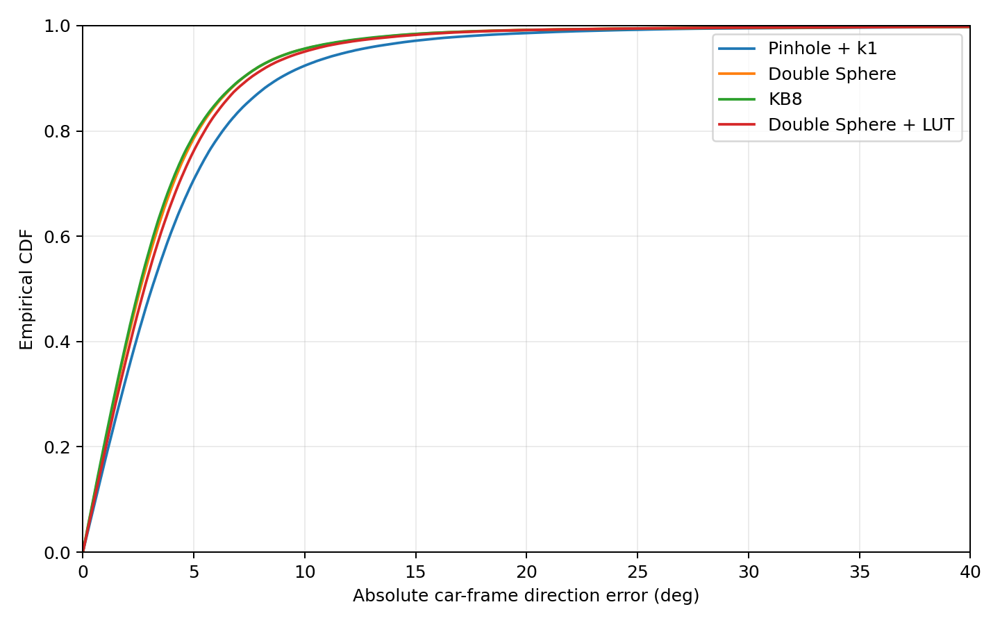
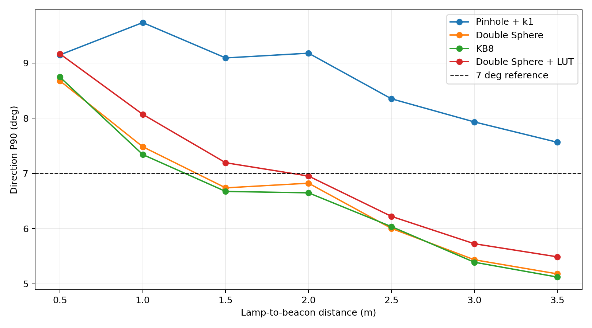
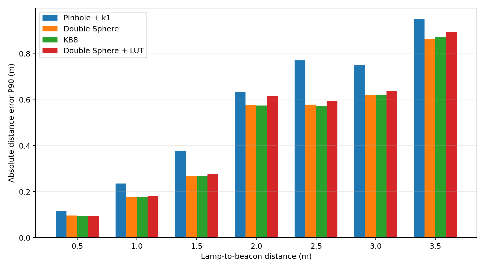

# 三摄鱼眼相机模型离线拟合与验证报告

## 一、先看结论

1. **建议优先把 Double Sphere 作为正式固件候选。** 它与 KB8 的方向精度几乎相同，但计算量更小、灾难误差率略低。
2. **KB8 是纯精度略优的模型。** 它的同摄/跨摄方向 P90 只比 Double Sphere 好约 0.02-0.03°，不足以抵消更高的计算复杂度。
3. **9x7 二维残差表没有带来留出集收益。** 它在训练数据上可以继续降低残差，但验证结果反而略差，说明出现了过拟合，不建议进固件。
4. **固定图像延迟补偿不值得加入。** 扫描三路 0-50 ms 后，最差 P90 只改善约 0.01°，远低于预设的 1° 接受门槛。
5. **方向解算明显进步，但尚未完全达标。** 宽角模型的跨摄 P90 已低于 7°，同摄 P90 仍约 7.4°，灾难误差率也仍高于 0.2%。
6. **绝对距离只在约 0.5-1.0 m 范围较可靠。** 距离增大后尺度误差快速增加，因此当前参数更适合先改善 CarPlan3 行驶方向，不能宣称已经精确解决全距离测距。

本报告只完成离线比较和参数输出，**没有替换 `Three_Camera.c/.h` 或 `car_plan_3.c` 的正式模型**。

## 二、数据、物理假设与验证方法

- 共解析 14 份完整 CSV。按照 I1-I48 原始检测是否变化进行精确去重后，保留 434,111 个回放样本。
- 车灯中心和信标中心都按 `z=0` 地面点处理；文件名中的距离表示两者中心的水平欧氏距离。
- 期望车体目标角为 `wrap(-car_yaw)`。也就是说，当车 yaw 为正时，图像解算出的目标方向应在车体坐标系中相应向左旋转。
- 同一摄像头同时看到车灯和信标时，优先使用该摄像头内的相对向量；只有没有同摄组合时才进入跨摄外参解算。
- 训练阶段允许使用文件名距离进行候选关联和鲁棒剔除；验证阶段选择候选时完全不读取文件名距离，只使用近车灯过滤、短时连续性、同摄优先和最近投影目标。
- 投影后车灯到信标小于 0.20 m 的组合视为明显的近车灯误检并立即判无效，不输出历史方向代替。
- 主验证严格按整份日志拆分：无 `_2` 后缀训练、`_2` 验证，再反向验证一次。没有随机拆帧，因此相邻帧不会同时落入训练集和验证集。
- 另外执行 7 组留一距离验证：每次完全拿掉一个距离的两份日志，使用其余六个距离重新拟合，再验证被拿掉的距离。
- 全局 yaw 偏置保持现值不动。原因是仅凭这些相对几何日志，所有相机共同绕 Z 轴旋转与全局 yaw 偏置之间存在不可辨识自由度。
- 复现命令：`python tools/camera_model_fit.py --data-dir "D:/Downloads/摄像头拟合"`。

## 三、指标怎么理解

- **同摄**：被选中的车灯与信标来自同一个摄像头。它主要检验单个镜头的畸变模型和车灯长轴投影。
- **跨摄**：车灯和信标不在同一个摄像头内。除了内参畸变，还会受到三摄旋转和平移外参误差影响。
- **方向误差**：解算出的车体目标方向与 `wrap(-car_yaw)` 的最小圆周角误差，单位为度。这个指标直接对应车模应该向左/向右转多少。
- **P50**：一半有效样本的误差不超过该值，反映日常典型表现。
- **P90**：90% 有效样本的误差不超过该值，是本次方向选型最重要的指标。
- **P99**：99% 有效样本的误差不超过该值，用于观察长尾风险。
- **覆盖率**：原始数据存在车灯和信标候选时，最终成功得到可信方向的比例。判无效的组合计入覆盖率损失。
- **灾难误差率**：方向误差大于 30° 的有效样本比例。这类错误可能让车明显跑偏，不能只看 P50 而忽略。
- **距离 P50/P90**：车灯中心到信标中心的绝对距离误差分位数，单位为米。

参考目标：覆盖率不低于 98%；同摄方向 P90 不高于 6°；跨摄方向 P90 不高于 7°；灾难误差率不高于 0.2%；距离中位误差不高于 `max(0.08 m, 5%距离)`，距离 P90 不高于 `max(0.20 m, 15%距离)`。

## 四、当前固件基线

当前正式固件日志基线保持原值：同摄方向 P50/P90 为 **4.60°/13.13°**，跨摄为 **4.52°/8.99°**。

下面的“针孔 + k1（重拟合）”不是旧固件逐行复刻。它与三种鱼眼候选统一使用 `z=0`、相同候选过滤和相同融合逻辑，用于公平判断模型本身的差异。

## 五、主验证结果：整日志双向验证

| 模型 | 配对类型 | 方向 P50（°） | 方向 P90（°） | 方向 P99（°） | 方向均值（°） | 覆盖率 | >30° 比例 | 距离 P50（m） | 距离 P90（m） |
|---|---:|---:|---:|---:|---:|---:|---:|---:|---:|
| 针孔 + k1（重拟合） | 同摄 | 3.21 | 9.20 | 22.56 | 4.45 | 99.42% | 0.408% | 0.098 | 0.567 |
| 针孔 + k1（重拟合） | 跨摄 | 2.57 | 7.14 | 26.44 | 3.77 | 98.15% | 0.941% | 0.196 | 0.602 |
| Double Sphere | 同摄 | 2.69 | 7.47 | 17.78 | 3.68 | 99.37% | 0.292% | 0.084 | 0.452 |
| Double Sphere | 跨摄 | 2.15 | 5.74 | 24.82 | 3.12 | 98.14% | 0.845% | 0.187 | 0.559 |
| Kannala-Brandt 8 | 同摄 | 2.62 | 7.43 | 17.92 | 3.64 | 99.39% | 0.317% | 0.084 | 0.450 |
| Kannala-Brandt 8 | 跨摄 | 2.10 | 5.72 | 26.65 | 3.13 | 98.16% | 0.899% | 0.187 | 0.560 |
| Double Sphere + 9x7 残差表 | 同摄 | 2.86 | 7.84 | 18.37 | 3.87 | 99.31% | 0.305% | 0.085 | 0.468 |
| Double Sphere + 9x7 残差表 | 跨摄 | 2.36 | 5.85 | 23.37 | 3.27 | 98.17% | 0.820% | 0.183 | 0.573 |

### 主验证结论

- Double Sphere 相比当前固件，同摄 P90 降低 43.1%，跨摄 P90 降低 36.2%。
- Double Sphere 同摄 P90 为 7.47°。含义是：在成功输出的同摄样本中，90% 的方向误差不超过该值；虽然明显优于 13.13° 基线，但仍未达到 6° 目标。
- Double Sphere 跨摄 P90 为 5.74°，KB8 为 5.72°，两者均达到跨摄不高于 7° 的目标。
- 同摄/跨摄整体覆盖率超过 98%，但 3.5 m 分桶覆盖率低于 98%；Double Sphere 方向 P90 最差的单份日志是 `车灯距离为0,5米_2.csv`。
- 所有候选的灾难误差率都高于 0.2%。报告保留这些错误，没有通过继续加硬门限、降低覆盖率来隐藏它们。
- 距离目标大致只在 0.5-1.0 m 满足。日志没有飞机水平位置，飞机移动、相机平移、高度偏差和畸变参数会共同影响距离尺度，因此方向比绝对距离更容易从现有数据中可靠拟合。

累计分布曲线越靠左上越好。Double Sphere 与 KB8 基本重合，并且整体优于重拟合针孔模型；30° 之后仍存在少量长尾，对应表中的灾难误差。

## 六、不同真实距离下的表现

这张表用于判断模型是否只在某一个距离上有效。方向 P90 越小越好；距离 P50/P90 是绝对误差，不是测量值本身。

| 模型 | 真实距离 | 方向 P90（°） | 距离 P50（m） | 距离 P90（m） | 覆盖率 |
|---|---:|---:|---:|---:|---:|
| 针孔 + k1（重拟合） | 0.5 m | 9.15 | 0.044 | 0.116 | 99.97% |
| 针孔 + k1（重拟合） | 1.0 m | 9.73 | 0.076 | 0.235 | 99.78% |
| 针孔 + k1（重拟合） | 1.5 m | 9.09 | 0.109 | 0.378 | 99.63% |
| 针孔 + k1（重拟合） | 2.0 m | 9.18 | 0.202 | 0.635 | 99.25% |
| 针孔 + k1（重拟合） | 2.5 m | 8.35 | 0.263 | 0.771 | 98.81% |
| 针孔 + k1（重拟合） | 3.0 m | 7.93 | 0.280 | 0.752 | 98.62% |
| 针孔 + k1（重拟合） | 3.5 m | 7.56 | 0.361 | 0.951 | 97.46% |
| Double Sphere | 0.5 m | 8.68 | 0.037 | 0.096 | 99.97% |
| Double Sphere | 1.0 m | 7.48 | 0.079 | 0.177 | 99.79% |
| Double Sphere | 1.5 m | 6.74 | 0.084 | 0.270 | 99.63% |
| Double Sphere | 2.0 m | 6.82 | 0.159 | 0.578 | 99.25% |
| Double Sphere | 2.5 m | 6.00 | 0.207 | 0.578 | 98.76% |
| Double Sphere | 3.0 m | 5.44 | 0.246 | 0.620 | 98.58% |
| Double Sphere | 3.5 m | 5.18 | 0.328 | 0.864 | 97.25% |
| Kannala-Brandt 8 | 0.5 m | 8.75 | 0.035 | 0.094 | 99.97% |
| Kannala-Brandt 8 | 1.0 m | 7.34 | 0.080 | 0.175 | 99.79% |
| Kannala-Brandt 8 | 1.5 m | 6.67 | 0.082 | 0.269 | 99.64% |
| Kannala-Brandt 8 | 2.0 m | 6.65 | 0.156 | 0.574 | 99.26% |
| Kannala-Brandt 8 | 2.5 m | 6.04 | 0.206 | 0.572 | 98.78% |
| Kannala-Brandt 8 | 3.0 m | 5.39 | 0.249 | 0.618 | 98.58% |
| Kannala-Brandt 8 | 3.5 m | 5.12 | 0.329 | 0.874 | 97.34% |
| Double Sphere + 9x7 残差表 | 0.5 m | 9.17 | 0.037 | 0.094 | 99.97% |
| Double Sphere + 9x7 残差表 | 1.0 m | 8.07 | 0.082 | 0.183 | 99.79% |
| Double Sphere + 9x7 残差表 | 1.5 m | 7.19 | 0.087 | 0.279 | 99.63% |
| Double Sphere + 9x7 残差表 | 2.0 m | 6.95 | 0.159 | 0.617 | 99.24% |
| Double Sphere + 9x7 残差表 | 2.5 m | 6.22 | 0.213 | 0.596 | 98.71% |
| Double Sphere + 9x7 残差表 | 3.0 m | 5.73 | 0.241 | 0.637 | 98.42% |
| Double Sphere + 9x7 残差表 | 3.5 m | 5.49 | 0.328 | 0.894 | 97.05% |

从结果可以看到，鱼眼模型在 1.5-3.5 m 的方向解算优势最明显；0.5 m 和 1.0 m 的方向 P90 仍偏高，说明近距离大视场边缘、车灯长轴投影或误检关联仍是主要误差源。距离误差则随真实距离增加而明显增大。

上图中虚线为 7° 参考目标。鱼眼模型在 1.5 m 以后逐渐低于该线，但近距离仍没有达到目标。

距离误差随真实距离增大，说明当前日志对绝对尺度的约束不足；这不是换成更高阶鱼眼模型就能自动消除的问题。

## 七、摄像头、图像区域与飞机姿态变化

“图像中心/边缘”按参与投影点的归一化半径分组；“低/高姿态变化”按样本姿态变化率的中位数二分。该表用于检查模型是否只在中心区域或飞机平稳时有效。

| 模型 | 分组 | 方向 P90（°） | 距离 P90（m） | 覆盖率 |
|---|---|---:|---:|---:|
| 针孔 + k1（重拟合） | 前摄 | 8.88 | 0.557 | 99.34% |
| 针孔 + k1（重拟合） | 中摄 | 8.63 | 0.470 | 99.30% |
| 针孔 + k1（重拟合） | 后摄 | 9.17 | 0.724 | 98.89% |
| 针孔 + k1（重拟合） | 图像中心 | 6.52 | 0.419 | 99.56% |
| 针孔 + k1（重拟合） | 图像边缘 | 9.06 | 0.585 | 99.19% |
| 针孔 + k1（重拟合） | 低姿态变化 | 8.31 | 0.486 | 99.45% |
| 针孔 + k1（重拟合） | 高姿态变化 | 9.42 | 0.646 | 98.98% |
| Double Sphere | 前摄 | 6.90 | 0.508 | 99.26% |
| Double Sphere | 中摄 | 7.67 | 0.264 | 99.29% |
| Double Sphere | 后摄 | 6.97 | 0.648 | 98.90% |
| Double Sphere | 图像中心 | 5.78 | 0.421 | 99.57% |
| Double Sphere | 图像边缘 | 7.32 | 0.477 | 99.15% |
| Double Sphere | 低姿态变化 | 6.99 | 0.398 | 99.43% |
| Double Sphere | 高姿态变化 | 7.41 | 0.549 | 98.92% |
| Kannala-Brandt 8 | 前摄 | 6.97 | 0.513 | 99.27% |
| Kannala-Brandt 8 | 中摄 | 7.64 | 0.257 | 99.35% |
| Kannala-Brandt 8 | 后摄 | 6.77 | 0.681 | 98.82% |
| Kannala-Brandt 8 | 图像中心 | 5.73 | 0.411 | 99.57% |
| Kannala-Brandt 8 | 图像边缘 | 7.31 | 0.478 | 99.17% |
| Kannala-Brandt 8 | 低姿态变化 | 6.96 | 0.396 | 99.44% |
| Kannala-Brandt 8 | 高姿态变化 | 7.39 | 0.548 | 98.95% |
| Double Sphere + 9x7 残差表 | 前摄 | 7.15 | 0.521 | 99.28% |
| Double Sphere + 9x7 残差表 | 中摄 | 8.18 | 0.288 | 99.25% |
| Double Sphere + 9x7 残差表 | 后摄 | 7.25 | 0.658 | 98.75% |
| Double Sphere + 9x7 残差表 | 图像中心 | 5.84 | 0.418 | 99.56% |
| Double Sphere + 9x7 残差表 | 图像边缘 | 7.65 | 0.495 | 99.10% |
| Double Sphere + 9x7 残差表 | 低姿态变化 | 7.26 | 0.406 | 99.41% |
| Double Sphere + 9x7 残差表 | 高姿态变化 | 7.79 | 0.569 | 98.85% |

## 八、留一距离验证

每一行都表示：该距离的两份日志完全不参加拟合，只用其他六个距离训练，然后测试模型对这个未见距离的泛化能力。它比随机拆帧更严格，也更接近换一个实际车灯距离后的表现。

| 模型 | 完全留出的距离 | 方向 P90（°） | 距离 P90（m） | 覆盖率 |
|---|---:|---:|---:|---:|
| 针孔 + k1（重拟合） | 0.5 m | 9.16 | 0.138 | 99.97% |
| 针孔 + k1（重拟合） | 1.0 m | 9.90 | 0.226 | 99.79% |
| 针孔 + k1（重拟合） | 1.5 m | 8.91 | 0.374 | 99.63% |
| 针孔 + k1（重拟合） | 2.0 m | 8.91 | 0.640 | 99.28% |
| 针孔 + k1（重拟合） | 2.5 m | 8.19 | 0.764 | 98.82% |
| 针孔 + k1（重拟合） | 3.0 m | 7.75 | 0.800 | 98.64% |
| 针孔 + k1（重拟合） | 3.5 m | 7.43 | 0.951 | 97.76% |
| Double Sphere | 0.5 m | 8.76 | 0.111 | 99.97% |
| Double Sphere | 1.0 m | 7.30 | 0.170 | 99.79% |
| Double Sphere | 1.5 m | 6.23 | 0.273 | 99.64% |
| Double Sphere | 2.0 m | 6.16 | 0.620 | 99.26% |
| Double Sphere | 2.5 m | 5.68 | 0.626 | 98.76% |
| Double Sphere | 3.0 m | 5.17 | 0.645 | 98.63% |
| Double Sphere | 3.5 m | 4.93 | 0.880 | 97.27% |
| Kannala-Brandt 8 | 0.5 m | 8.54 | 0.108 | 99.97% |
| Kannala-Brandt 8 | 1.0 m | 7.41 | 0.168 | 99.79% |
| Kannala-Brandt 8 | 1.5 m | 6.33 | 0.278 | 99.63% |
| Kannala-Brandt 8 | 2.0 m | 6.24 | 0.608 | 99.28% |
| Kannala-Brandt 8 | 2.5 m | 5.97 | 0.622 | 98.76% |
| Kannala-Brandt 8 | 3.0 m | 5.46 | 0.661 | 98.65% |
| Kannala-Brandt 8 | 3.5 m | 4.92 | 0.830 | 97.69% |
| Double Sphere + 9x7 残差表 | 0.5 m | 8.81 | 0.110 | 99.97% |
| Double Sphere + 9x7 残差表 | 1.0 m | 7.79 | 0.176 | 99.79% |
| Double Sphere + 9x7 残差表 | 1.5 m | 6.88 | 0.283 | 99.64% |
| Double Sphere + 9x7 残差表 | 2.0 m | 6.57 | 0.633 | 99.27% |
| Double Sphere + 9x7 残差表 | 2.5 m | 6.09 | 0.666 | 98.68% |
| Double Sphere + 9x7 残差表 | 3.0 m | 5.44 | 0.657 | 98.60% |
| Double Sphere + 9x7 残差表 | 3.5 m | 5.43 | 0.935 | 97.24% |

## 九、使用全部 14 份日志拟合的最终参数

参数顺序说明：针孔模型为 `f, cx, cy, k1`；Double Sphere 为 `fx, fy, cx, cy, xi, alpha`；KB8 为 `fx, fy, cx, cy, k1, k2, k3, k4`。
平移外参采用飞机 FRD 机体系，单位为米；中摄固定为平移基准 `(0,0,0)`。完整的 3x3 相机到机体旋转矩阵和 9x7 残差表节点位于 `model_parameters.json`。
需要注意：Double Sphere 后摄的 `alpha` 已接近本次设置的上界。这说明现有日志对部分参数的约束仍不充分。表中的平移应先视为能够解释日志的“有效外参”，在写入固件前最好与实际安装尺寸或标准标定板结果交叉检查。

| 模型 | 摄像头 | 内参 | 机体系平移（m） |
|---|---|---|---|
| 针孔 + k1（重拟合） | 前摄 | `78.97208, 5.619279, 1.081543, 0.7824874` | `0.05588, -0.05829, 0.02251` |
| 针孔 + k1（重拟合） | 中摄 | `92.7136, -2.897291, -6.916998, 1.379128` | `0.00000, 0.00000, 0.00000` |
| 针孔 + k1（重拟合） | 后摄 | `87.04516, -2.311764, -0.2617003, 1.085747` | `0.10042, -0.01511, 0.02368` |
| Double Sphere | 前摄 | `71.75701, 70.01779, 5.806646, -2.565904, 0.0009974444, 0.6857958` | `0.09727, -0.07358, 0.10804` |
| Double Sphere | 中摄 | `88.62802, 88.88962, -0.9190572, -8.552167, 0.08177242, 0.8428245` | `0.00000, 0.00000, 0.00000` |
| Double Sphere | 后摄 | `96.56589, 95.08795, -2.47083, -4.084619, 0.326467, 0.8498357` | `-0.04775, -0.01825, 0.13192` |
| Kannala-Brandt 8 | 前摄 | `68.26752, 65.64211, 5.317188, -3.257104, 0.09887123, -0.07954054, 0.006399183, 0.003846768` | `0.16314, -0.07534, 0.10500` |
| Kannala-Brandt 8 | 中摄 | `84.46399, 84.3677, -1.941408, -8.841453, -0.03548944, -0.1550082, 0.1099069, -0.02026726` | `0.00000, 0.00000, 0.00000` |
| Kannala-Brandt 8 | 后摄 | `73.38242, 72.78329, -2.344476, -4.383389, 0.08096282, -0.2155975, 0.1181395, -0.01987454` | `0.01892, -0.00473, 0.10575` |
| Double Sphere + 9x7 残差表 | 前摄 | `71.75701, 70.01779, 5.806646, -2.565904, 0.0009974444, 0.6857958` | `0.09727, -0.07358, 0.10804` |
| Double Sphere + 9x7 残差表 | 中摄 | `88.62802, 88.88962, -0.9190572, -8.552167, 0.08177242, 0.8428245` | `0.00000, 0.00000, 0.00000` |
| Double Sphere + 9x7 残差表 | 后摄 | `96.56589, 95.08795, -2.47083, -4.084619, 0.326467, 0.8498357` | `-0.04775, -0.01825, 0.13192` |

## 十、固定图像延迟扫描

三路相机分别扫描 0-50 ms，步长 5 ms。离线回放会插值飞机姿态，并使用车端 `yaw_rate` 把车灯横轴补偿到当前时刻。日志没有飞机水平位置，因此无法补偿延迟期间飞机的水平平移。

只有完整留出集的最差 P90 至少改善 1° 且覆盖率不下降，延迟方案才允许被接受。

| 模型 | 前/中/后摄延迟 | 补偿前最差 P90（°） | 补偿后最差 P90（°） | 补偿前/后覆盖率 | 是否接受 |
|---|---|---:|---:|---:|---:|
| 针孔 + k1（重拟合） | 5/5/10 ms | 9.20 | 9.19 | 98.15% / 98.15% | 否 |
| Double Sphere | 0/20/5 ms | 7.47 | 7.46 | 98.14% / 98.14% | 否 |
| Kannala-Brandt 8 | 0/25/0 ms | 7.43 | 7.42 | 98.16% / 98.16% | 否 |
| Double Sphere + 9x7 残差表 | 5/25/0 ms | 7.84 | 7.83 | 98.17% / 98.20% | 否 |

扫描结果只改善约 0.01°，远小于 1° 门槛，因此四个模型都不建议加入时序补偿。

## 十一、250 MHz Cortex-M7 计算量估算

估算假设：单精度除法和平方根各按约 14 周期，libm 三角函数按约 100 周期，最坏一次处理 15 个投影点。该结果用于模型选型，不是板上 DWT 实测；编译器优化和数学库实现会改变绝对耗时。

| 模型 | 每点平方根 | 每点除法 | 每点三角函数 | Newton 次数 | 15 点估算耗时 | 占 10 ms 周期 |
|---|---:|---:|---:|---:|---:|---:|
| 针孔 + k1（重拟合） | 0 | 3 | 0 | 0 | 6.42 us | 0.064% |
| Double Sphere | 2 | 5 | 0 | 0 | 12.48 us | 0.125% |
| Kannala-Brandt 8 | 1 | 9 | 2 | 6 | 30.60 us | 0.306% |
| Double Sphere + 9x7 残差表 | 3 | 5 | 5 | 0 | 46.32 us | 0.463% |

## 十二、最终选型建议

**只看方向 P90：KB8 略优。** 但它相对 Double Sphere 只领先约 0.02-0.03°，灾难误差率还略高，因此不能认为 KB8 在工程上明显更稳定。

**综合精度、稳定性和耗时：建议优先选择 Double Sphere。** 它的 15 点估算耗时为 12.48 us，KB8 为 30.60 us；两者精度几乎持平，而 Double Sphere 的灾难误差率略低。

**不建议选择 9x7 残差表，也不建议加入固定延迟补偿。** 两者都没有通过完整留出集证明收益。

当前仍需正视两个问题：

- 同摄方向 P90 仍约 7.4°，没有达到 6°；近距离 `0.5 m` 的方向表现尤其差。后续应重点检查近距离边缘成像、车灯长轴角度和图像误检，而不是继续堆叠更复杂的查表。
- 1.5 m 以后绝对距离明显不达标。若距离必须精确，建议补充相机标准鱼眼标定、实测三摄安装平移、飞机水平位置/速度或静态标定架数据，将内参、外参、高度和移动造成的尺度误差分开。

在你确认模型前，本工具不会自动改写正式固件。按当前数据，下一步应先确认是否接受 Double Sphere 的精度边界，再将对应参数以保持 `Three_Camera_Update` 接口不变的方式移植到固件。

## 十三、生成文件与技术依据

- `model_parameters.json`：使用全部 14 份日志拟合的最终参数。
- `metrics_summary.csv`：报告中所有分组指标的完整数据。
- `timing_estimate.csv`：每点运算次数和 M7 耗时估算。
- `delay_scan.json`：每个模型的三摄延迟扫描结果。
- `plots/direction_error_cdf.png`：方向误差累计分布。
- `plots/direction_p90_by_distance.png`：不同真实距离的方向 P90。
- `plots/distance_p90_by_distance.png`：不同真实距离的距离误差 P90。

技术依据：[OpenCV 鱼眼/Kannala-Brandt 模型](https://docs.opencv.org/4.x/db/d58/group__calib3d__fisheye.html)；[Double Sphere 模型论文](https://arxiv.org/abs/1807.08957)。
